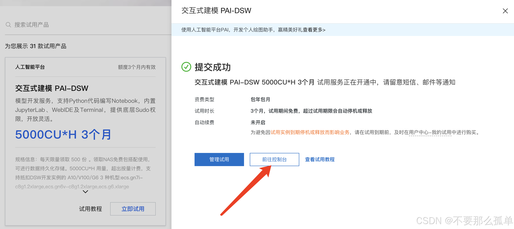
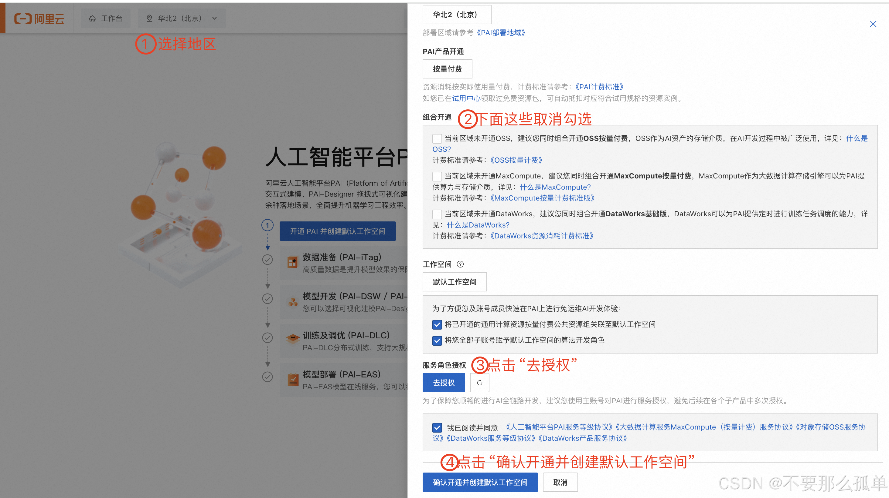
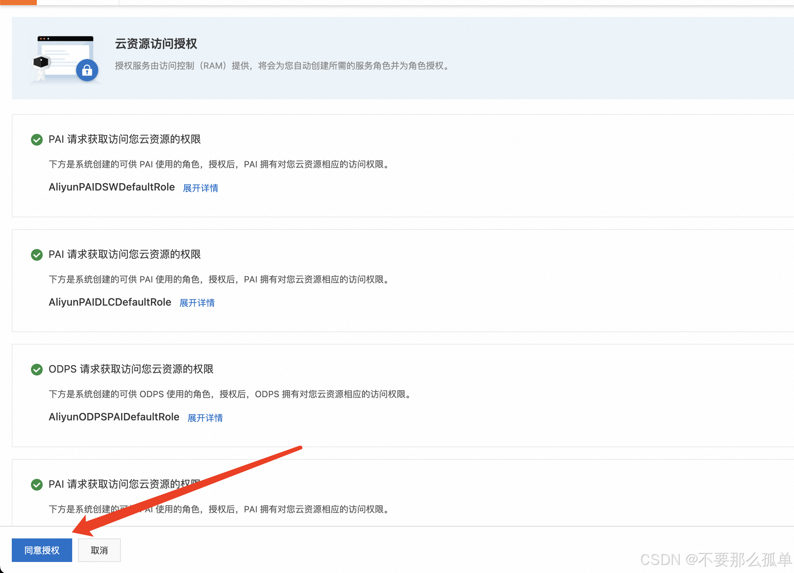
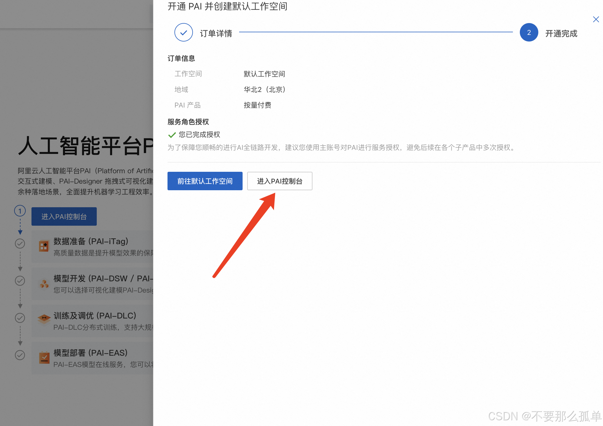
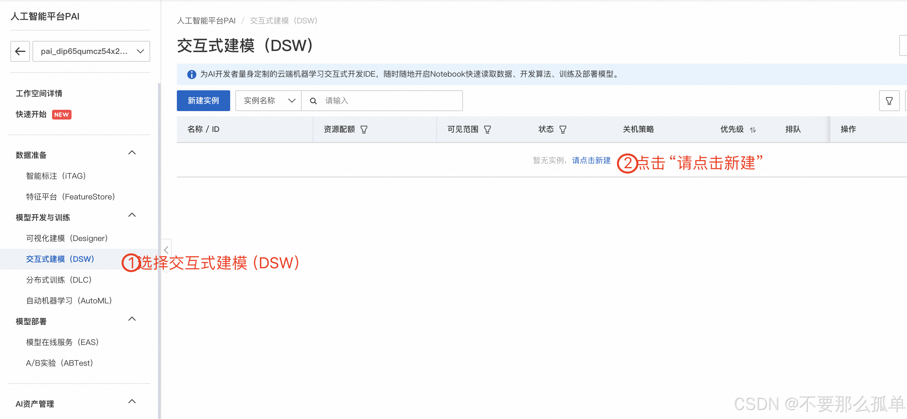
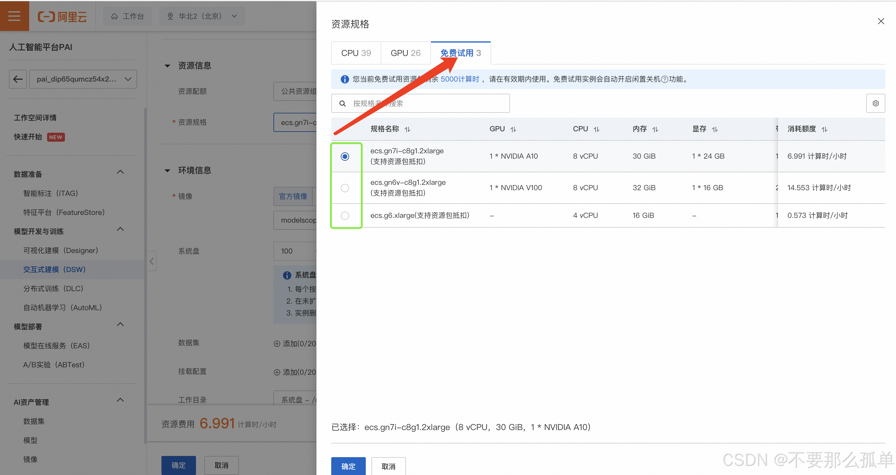
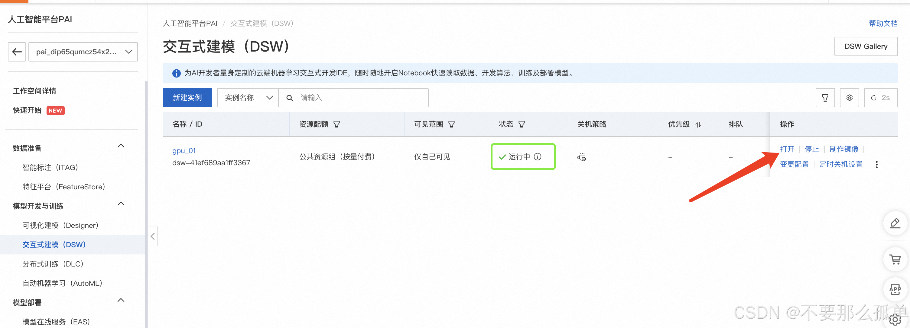
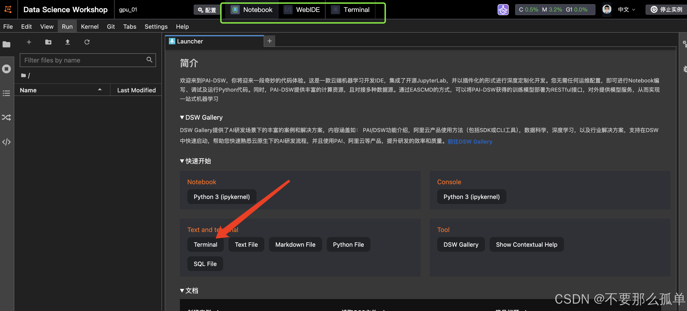
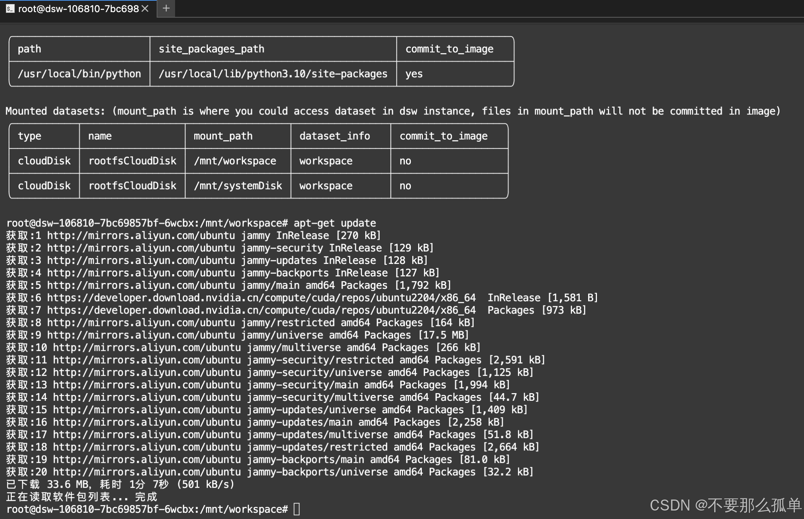
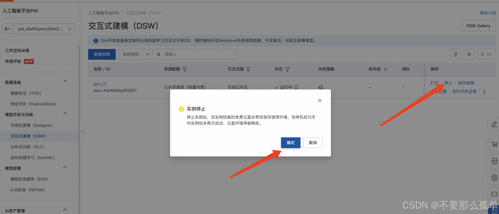

## 系统
&emsp;因为我使用的是macbook，没有NVIDIA显卡的，确实当时有装逼的成分，现在想着用起来确实有些后悔，哈哈哈。但抛去没有NVIDIA支持，用来做其他开发确实方便。听说苹果也会在AI上发力，目前来看确实较NVIDIA相差甚远，期待后续表现。

## 云服务器
&emsp;所以，不得不想其他办法。首先想到的就是云服务器，目前这个云那个云多到不行，提供GPU服务的也越来越多，因为要用到显卡，所以需要提供GPU的云服务器。

&emsp;本来想着买一个，但是碍于能白嫖绝不花钱的理论，最后选定**阿里云交互式建模（DSW）**，只要没有申请过 PAI-DSW 资源的新老用户皆可申请 5000CU 的免费额度，3个月内使用。
阿里云免费试用活动页：[点这里获取免费的GPU服务器](https://free.aliyun.com/)

**项目地址：[dive-into-cuda](https://github.com/hujianbin03/dive-into-cuda)**
## 操作步骤
#####	1. 点击上面的链接，找到试用产品交互式建模（DSW）。

#####	2. 点击试用，完成注册、实名，然后点击“立即试用”，继续点击“前往控制台”。

#####	3. 选择地区，取消勾选，去授权，最后点击“确认开通并创建默认工作空间”，然后需要等一会。


#####	4. 点击“进入PAI控制台”

#####	5. 新建交互式建模（DSW）实例。
1. 输入实例名称。
2. 选择资源规格：**GPU 选择 A10 或者 V100 都行，这俩是支持资源包抵扣的，其他的不支持**，V100 性能更好，但消耗算力也更多，**学习玩一玩的话就选 A10 就行**，A10 显卡每小时消耗6.991计算时，如果不关机持续使用大概可以使用30天。
3. 选择镜像，用官方默认就行，或者根据自己需求选择。
4. 其他默认就可以，不需要修改，点击“确定”。


#####	6. 下一步，创建实例，等待几分钟。然后点击“打开”。

#####	7. 下面的图片就是，打开实例之后的页面。上方三个框框，Notebook、WebIDE和Terminal，分别是jupyter lab、vscode和命令终端。你也可以选择下面的小框框进入终端界面。我们来进行一点点的配置。

* 点击下面的框框terminal，进入终端界面。
* 需要更新apt-get
```
apt-get update
```

**阿里云不需要配置pip镜像源，阿里云已经配置过了**。也可以直接git clone项目。做到这里，阿里云服务器已经配置完毕。

#####	8.避免浪费，每天使用完记得停止实例，用的时候再打开。

#####	9. 遇到DSW的问题，查阅官方文档：[交互式建模（DSW）](https://help.aliyun.com/zh/pai/user-guide/dsw-notebook-service/?spm=a2c4g.11186623.0.0.188544b1C5aV5I)