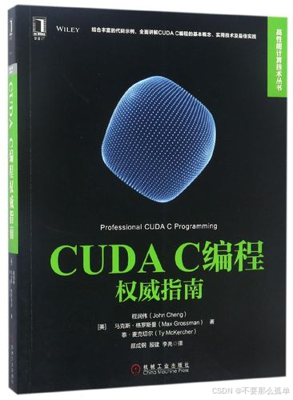

### 自我介绍
&emsp;&emsp;工作三年社畜，因项目变动被辞退，在家闲时刷视频，看了各种大模型，机器学习，AGI等内容，看完之后感觉，如果再不参与到其中，下一秒就会被社会抛弃，感觉到深深的焦虑不安。由于在某音人工智能之父某某舟的影响，于是开始自学，希望可以以此谋生，也希望和同行的人有更多的交流，欢迎来call我。
### 学习过程
&emsp;&emsp;大概看了三本书，鱼书《深度学习入门-基于Python的理论与实现》、花书《动手学深度学习（Pytorch）》、《自然语言处理入门》，鱼书和花书大多数相同，可以直接看花书。刚开始觉得纸质书更有质感，抱着书，还要对着电脑，属实麻烦，后来直接看电子书了。

&emsp;&emsp;接着是看视频，B站李沐老师的视频，可以配合《动手学深度学习（Pytorch）》书一起学习，一定会事半功倍。还有精度论文系列也是十分值得看的。了解深度学习的基本知识后，开始学习模型优化相关的内容，感觉是个不错的方向。于是开始看论文，查资料，复现代码等。

&emsp;&emsp;个人项目地址：[✨github✨](https://github.com/hujianbin03/)  ，包括有模型剪枝、量化和蒸馏的内容。说起来确实有些班门弄斧，感兴趣的可以去看看～
### 本篇专栏要写的内容
&emsp;&emsp;我们学习CUDA主要参考《CUDA C编程权威指南》，这篇专栏也会按照书中的章节进行。如果需要电子书的可以联系我。

&emsp;&emsp;本篇专栏想要讲的不仅仅是如何写代码，如果想要快速入手，可以查看 [CUDA的官方文档](https://docs.nvidia.com/cuda/doc/index.html)，我们学习编程应该**同时理解语言，编程模型，硬件执行模型，以及优化方法**，具体来说包括但不仅限于CUDA编程模型、GPU执行模型、GPU内存模型、CUDA流和事件、多GPU编程的相关技术、CUDA感知MPI编程和NVIDIA开发工具。单纯的学会写代码，能运行，这是培训班的节奏。

**希望你已经学会的**：
* C/C++ 编程经验，可能也会在文章中穿插一些相关知识，希望可以尽可能的大众、简单。
* 本篇专栏的重点还是讲一些基础的知识，可以作为入门的文章。包括基础知识，包括硬件基础，编程模型，性能方面，和简单的优化，以及项目实际中的一些技巧。

本专栏所有的文章以及代码，都会上传到这里：[**dive-into-cuda**](https://github.com/hujianbin03/dive-into-cuda)
### 写在最后
&emsp;&emsp;第一次写文章，不好的地方希望多包含。写的目的，一是为了记录，二是为了可以交到更多的朋友，手动鞠躬，～**代码改变世界，期待与你同行**～
