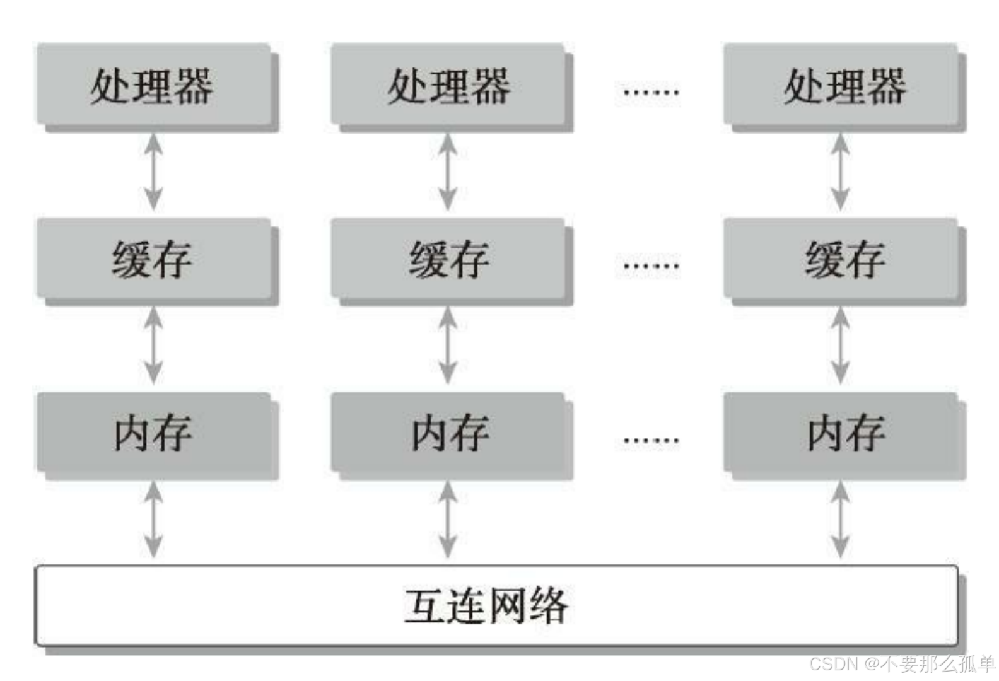

&emsp;&emsp;1971年，Intel推出了4004，世界上第一款商用微处理器...  
&emsp;&emsp;1999 年，NVIDIA 发明了 GPU...  
&emsp;&emsp;2005年，英特尔推出了首款用于桌面PC的奔腾D双核处理器...  
&emsp;&emsp;2006 年，CUDA 架构问世...  
&emsp;&emsp;2015 年，搭载 TEGRA X1 的 NVIDIA DRIVE 问世，NVIDIA 正式投身于深度学习领域...  
 
&emsp;&emsp;随着社会发展需求，计算机的硬件、技术和架构也在不断变化，我们不停的在追求更大的内存，更快的运行速度，更小更薄的硬件。为了更快，不由得会想到一个解决方案：当处理一个大的问题时，可以被分解成多个小问题，然后在不同的计算资源上并行处理这些小问题。这里就用到了今天要讲的“**并行计算**”，

&emsp;&emsp;从纯粹的计算视角来看，并行计算可以被定义为计算的一种形式，在这种形式下，计算机可以同时进行许多运算，计算原则是一个大的问题往往可以被划分为很多可以同时解决的小问题。

&emsp;&emsp;并行计算的软件和硬件层面是紧密联系的。事实上，并行计算通常涉及两
个不同的计算技术领域。
* 计算机架构（硬件方面）
* 并行程序设计（软件方面）

&emsp;&emsp;计算机架构关注的是在**结构级别上支持并行性**，而并行编程设计关注的是**充分使用计算机架构的计算能力来并发地解决问题**。

&emsp;&emsp;大多数现代处理器都应用了哈佛体系结构（Harvard architecture，后来演变出冯·诺依曼结构）主要分成三部分：
* 内存（指令内存和数据内存）
* 中央处理单元（控制单元和算术逻辑单元）
* 输入/输出接口

&emsp;&emsp;可以看到最关键部分是中央处理单元（CPU），CPU从最开始的单核到现在的多核，为的就是在体系结构级别支持并行性。当在多核计算机上执行算法时，对于程序员来说，**了解基本的计算机架构的特点**就显得非常重要了。要编写一个既正确又高效的并行程序需要对多核体系结构有一个基本的认识。

&emsp;&emsp;接下来介绍了并行计算的一些基本概念，以及这些概念与CUDA编程设计的联系。

### 1.串行编程和并行编程
&emsp;&emsp;当用计算机程序解决一个问题时，我们会很自然地把这个问题划分成许多的运算块，
每一个运算块执行一个指定的任务，如下图所示。这样的程序叫作串行程序。

&emsp;&emsp;没有执行次序的约束，则可以并发执行。所有包含并发执行任务的程序都是
并行程序。如下图所示，**一个并行程序中可能会有一些串行部分**。

**相关性**：当一个指令处理前一个指令产生的数据时，就有了数据相关性的概念。
&emsp;&emsp;在并行算法的实现中，分析数据的相关性是最基本的内容，因为相关性是限制并行性
的一个主要因素。
### 2.并行性
基础的并行类型可以分为两种：
* 任务并行：当许多任务或函数可以独立地、大规模地并行执行时，这就是任务并行。任务并行的重点在于利用多核系统**对任务进行分配**。任务并行常用于支付系统、购物系统等，同一时间要处理不同的任务请求。
* 数据并行：当可以同时处理许多数据时，这就是数据并行。数据并行的重点在于利用多核系统**对数据进行分配**。数据并行常用于处理方法是相同的，但是数据是不同且很多的时候，比如大模型计算、各种密集型计算等，所以，**CUDA编程非常适合解决数据并行计算的问题**。

&emsp;&emsp;数据并行程序设计的第一步是把数据依据线程进行划分，以使每个线程处理一部分数据。通常来说，有两种方法可以对数据进行划分：
* 块划分：在块划分中，一组连续的数据被分到一个块内。每个数据块以任意次序被安排给一个线程，线程通常在同一时间只处理一个数据块。

* 周期划分：线程按照顺序处理相邻的数据块，每个线程处理多个数据块。

程序性能通常对块的大小比较敏感。块划分与周期划分中划分方式的选择与计算机架构有密切关系。
### 3. 计算机架构
#### 3.1 弗林分类法
&emsp;&emsp;有多种不同的方法可以对计算机架构进行分类。一个广泛使用的分类方法是弗林分类
法（Flynn’s Taxonomy），它根据指令和数据进入CPU的方式，将计算机架构分为4种不同
的类型。
* 单指令单数据（SISD）：一种串行架构的传统计算机，上只有一个核心。在任何时间点上只有一个指令流在处理一个数据流。
* 单指令多数据（SIMD）：并行架构，且有多个核心。在任何时间点上所有的核心只有一个指令流处理不同的数据流，**现在大多数计算机都采用了SIMD架构**。
* 多指令单数据（MISD）：比较少见，在这种架构中，每个核心通过使用多个指令流处理同一个数据流
* 多指令多数据（MIMD）：并行架构，在这种架构中，多个核心使用多个指令流来异步处理多个数据流，从而实现空间上的并行性。许多MIMD架构还包括SIMD执行的子组件。

为了提高并行的计算能力，我们要从架构上实现下面这些性能提升：
* 降低延迟
* 提高带宽
* 提高吞吐量

延迟：是一个操作从开始到完成所需要的时间，常用微秒来表示。
带宽：是单位时间内可处理的数据量，通常表示为MB/s或GB/s。
吞吐量：是单位时间内成功处理的运算数量，通常表示为gflops（即每秒十亿次的浮点运算数量），特别是在重点使用浮点计算的科学计算领域经常用到。

**延迟用来衡量完成一次操作的时间，而吞吐量用来衡量在给定的单位时间内处理的操作量**。

#### 3.2 内存组织方式划分
计算机架构也能根据内存组织方式进行进一步划分，一般可以分成下面两种类型。
* 分布式内存的多节点系统
* 共享内存的多处理器系统

&emsp;&emsp;在分布式内存的多节点系统中，大型计算引擎是由许多网络连接的处理器构成的。每个处理器**有自己的本地内存**，而且处理器之间**可以通过网络进行通信**。内存的多节点系统，这种系统常被称作集群。

&emsp;&emsp;在共享内存的多处理器架构中，多处理器架构的大小通常是**从双处理器到几十个或几百个处理器之间**。这些处理器要么是与**同一个物理内存相关联，要么共用一个低延迟的链路**（如PCIExpress或PCIe）。

&emsp;&emsp;多个处理器可以分多片处理器，和单片多核（众核many-core），也就是有些主板上挂了好多片处理器，也有的是一个主板上就一个处理器，但是这个处理器里面有几百个核。**GPU就属于众核系统，即单片多核**。当然现在CPU也都是多核的了，但是他们还是有很大区别的：

* CPU：核心比较重，用来处理非常复杂的控制逻辑，以优化串行程序执行。
* GPU：核心较轻，用于优化具有简单控制逻辑的数据并行任务，注重并行程序的吞吐
量适。