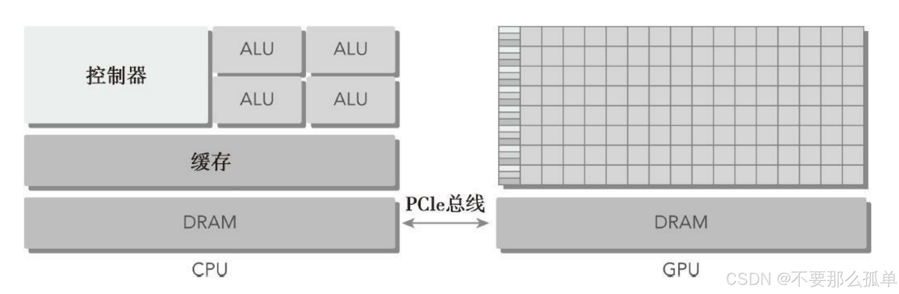
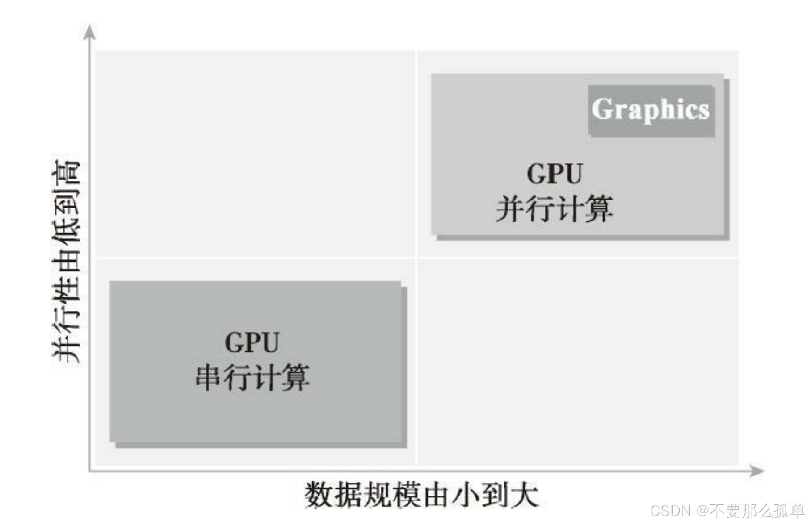

&emsp;&emsp;最初，计算机只包含用来运行编程任务的中央处理器（CPU），也被称为通用处理器，是计算机的心脏。它按照冯·诺依曼架构运行，包含运算器、控制器、存储器等主要部分。数据在存储器中存储，控制器从存储器中获取数据并交给运算器进行运算，运算完成后再将结果返回存储器。

&emsp;&emsp;CPU的特点是通用性强，指令复杂，需要资源调度、中断处理、内存管理等，运算过程逻辑控制多，控制单元数量多，计算单元数量受限，性能限制较大。所以CPU就像是一个全能的选手，什么都会做，但是做的不精。所以，针对不同的计算需求，我们开发了更多的专用的、强大的芯片来辅助CPU，如GPU更加专注于图形处理，并行计算能力和高吞吐量、DSP更加专注于卷积或傅里叶等数学计算加速。就像是一个优秀的team，为了解决某个问题，每个人都做自己擅长的事，这也就是我们要引出的异构计算了。

&emsp;&emsp;异构计算：主要是指使用**不同类型指令集**和**体系架构的计算单元组成系统**的计算方式，简单来讲，就是用不同制程架构、不同指令集、不同功能的硬件组合起来解决问题，这就是异构计算。而我们要讲的cuda，就来自CPU+GPU这样的异构架构中的。

### 1. 异构架构
&emsp;&emsp;一个典型的异构计算节点包括两个多核CPU插槽和两个或更多个的众核GPU。GPU不是一个独立运行的平台而是**CPU的协处理器**。因此，GPU必须通过PCIe总线与基于CPU的主机相连来进行操作，如下图所示。这就是为什么CPU所在的位置被称作主机端而GPU所在的位置被称作设备端。

一个异构应用包括两个部分。
* 主机代码
* 设备代码

&emsp;&emsp;主机代码在CPU上运行，设备代码在GPU上运行。异构平台上执行的应用通常由CPU
初始化。在设备端加载计算密集型任务之前，CPU代码负责管理设备端的环境、代码和数据。而GPU就是用来提高程序中并行数据的执行速度的。

描述GPU容量的两个重要特征。
* CUDA核心数量
* 内存大小

评估GPU的性能的两种不同的指标。
* 峰值计算性能：计算容量的一个指标，通常定义为每秒能处理的单精度或双精度浮点运算的数量。峰值性能通常用GFlops（每秒十亿次浮点运算）或TFlops（每秒万亿次浮点运算）来表示。
* 内存带宽：内存带宽是从内存中读取或写入数据的比率。内存带宽通常用GB/s表示。

nvidia自己有一套描述GPU计算能力的代码，其名字就是“计算能力”：

### 2. 异构计算范例
&emsp;&emsp;GPU计算并不是要取代CPU计算。对于特定的程序来说，每种计算方法都有它自己的优点。CPU计算适合处理控制密集型任务，GPU计算适合处理包含数据并行的计算密集型任务。GPU与CPU结合后，能有效提高大规模计算问题的处理速度与性能。如下图所示，可以从两个方面来区分CPU和GPU应用的范围。
* 并行级
* 数据规模

&emsp;&emsp;如果一个**问题有较小的数据规模、复杂的控制逻辑和/或很少的并行性**，那么最好选择CPU处理该问题，因为它有处理复杂逻辑和指令级并行性的能力。相反，如果该问题包含**较大规模的待处理数据并表现出大量的数据并行性**，那么使用GPU是最好的选择。因为GPU中有大量可编程的核心，可以支持大规模多线程运算，而且相比CPU有较大的峰值带宽。很容易想到，为获得最佳性能，**在CPU上执行串行部分或任务并行部分，在GPU上执行数据密集型并行部分**，如下图所示。

CPU和GPU线程的区别：
1. CPU线程是重量级实体，操作系统交替执行线程，线程上下文切换花销很大；GPU线程是轻量级的，GPU应用一般包含成千上万的线程，多数在排队状态，线程之间切换基本没有开销。
2.  CPU的核被设计用来尽可能减少一个或两个线程运行时间的延迟，而GPU的核有很多用来处理大量并发的、轻量级的线程，以最大限度地提高吞吐量。
### 3. CUDA：一种异构计算平台
&emsp;&emsp;CUDA是一种通用的并行计算平台和编程模型，它利用NVIDIA GPU中的并行计算引
擎能更有效地解决复杂的计算问题，并扩展出多语言支持。CUDA C 是标准ANSI C语言的扩展，扩展出一些语法和关键字来编写设备端代码，而且CUDA库本身提供了大量API来操作设备完成计算。

CUDA提供了两层API来管理GPU设备和组织线程，如下图：
* CUDA驱动API：是一种低级API，它相对来说较难编程，但是它对于在GPU设备使用上提供了更多的控制。
* CUDA运行时API：是一种高级API，它在驱动API的上层实现。每个运行时API函数都被分解为更多传给驱动API的基本运算。

&emsp;&emsp;运行时API和驱动API之间没有明显的性能差异。但这两种API是相互排斥的，你必须使用两者之一，从两者中混合函数调用是不可能的。我们要讲的所有例子**都使用运行时API**。

一个CUDA程序包含了以下两个部分的混合。
* 在CPU上运行的主机代码
* 在GPU上运行的设备代码

&emsp;&emsp;NVIDIA的CUDA nvcc编译器在**编译过程中将设备代码从主机代码中分离出来**。如下图所示，主机代码是标准的C代码，使用C编译器进行编译。设备代码，也就是核函数，是用扩展的带有标记数据并行函数关键字的CUDA C语言编写的。设备代码通过nvcc进行编译。在链接阶段，在内核程序调用和显示GPU设备操作中添加CUDA运行时库。

&emsp;&emsp;nvcc 是从LLVM开源编译系统为基础开发的，通过使用CUDA编译器SDK，你可以创建或扩展编程语言，如下图所示：

&emsp;&emsp;CUDA平台也是支持多样化并行计算生态系统的基础，如果你想在GPU上建立你的应用程序，强化GPU性能的最简单方法是使用CUDA工具包它为C和C++开发人员提供了一个综合的开发环境。CUDA工具包包括编译器、数学库，以及调试和优化应用程序性能的工具。同时提供了代码样例、编程指南、用户手册、API参考文档和其他帮助你入门的文档。当然，随着大模型的崛起，cuda平台的生态也会越加完善。
