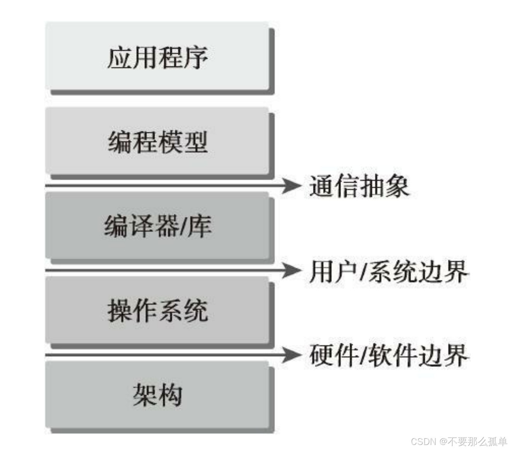
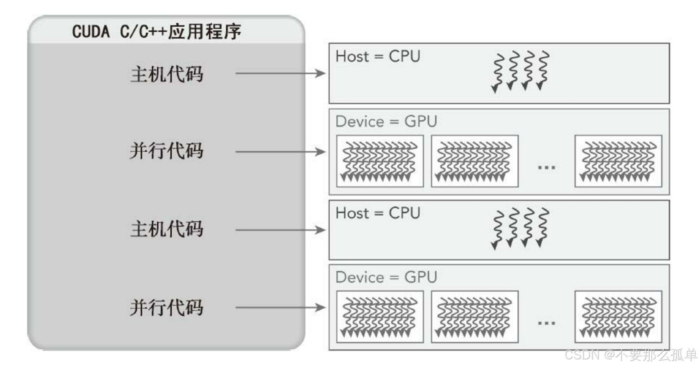
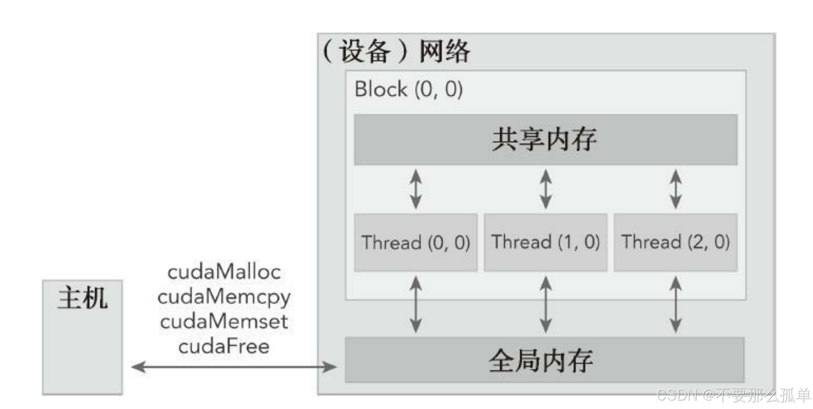
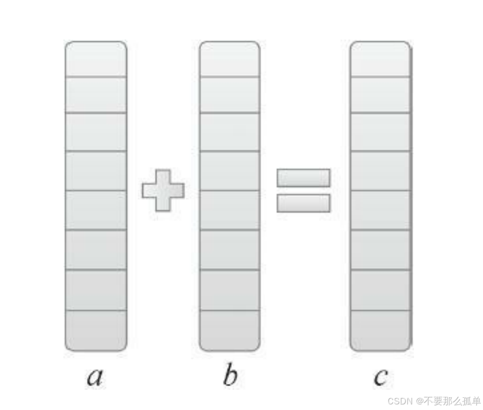
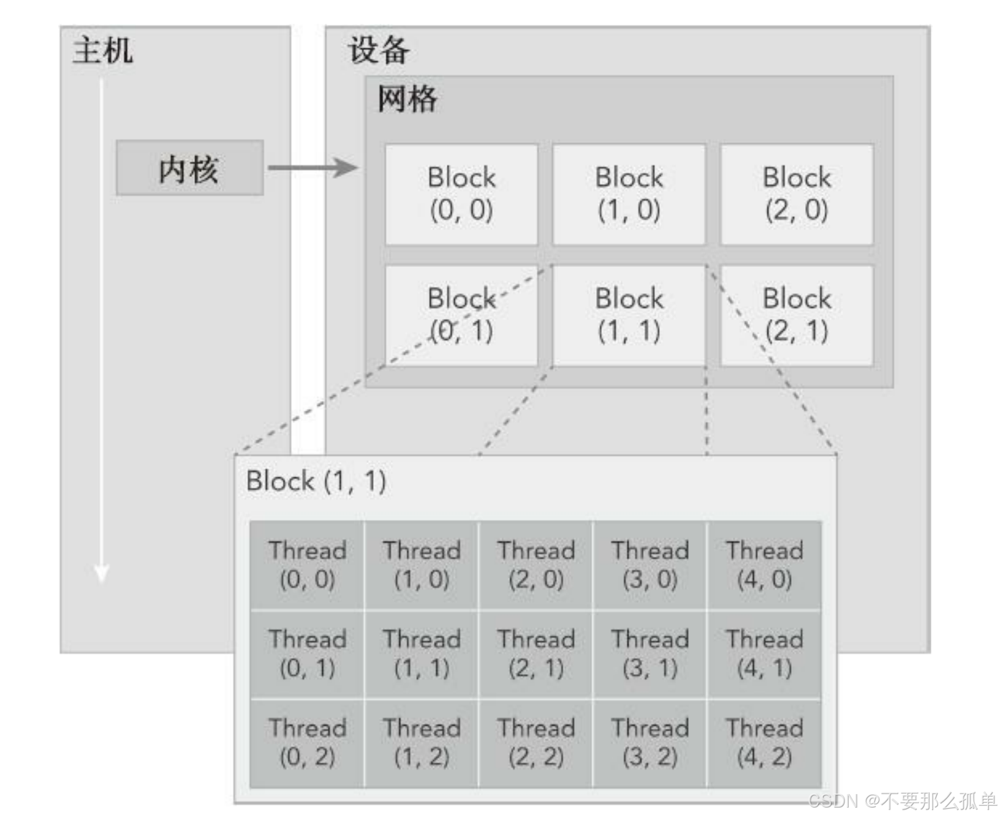
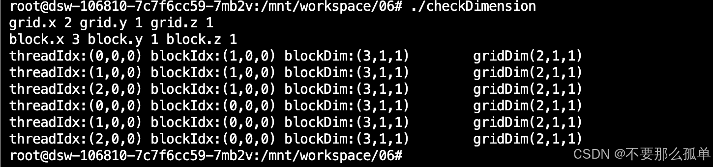
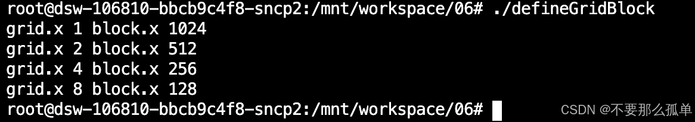
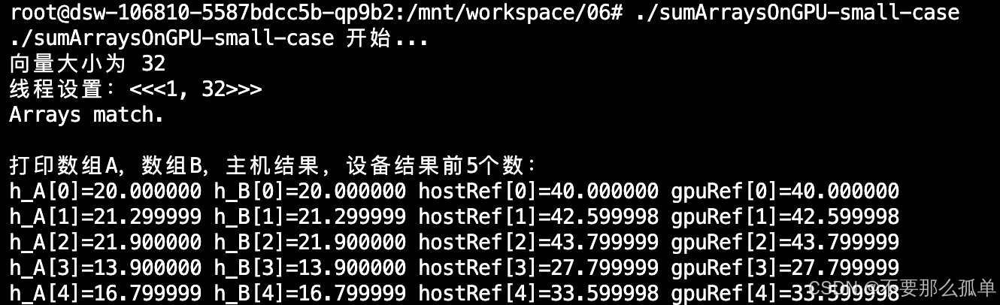

&emsp;&emsp;CUDA是一种**通用的并行计算平台和编程模型**，是在C语言基础上扩展的。借助于CUDA，你可以像编写C语言程序一样实现并行算法。编程模型就是告诉我们如何写CUDA程序，CUDA平台也提供了着一些列的工具供我们使用，这一章主要就是讲解这些工具怎么用，如何编写调试CUDA程序。我们将通过向量加法和矩阵加法这两个简单的例子来学习如何编写一个CUDA程序。

&emsp;&emsp;编程模型是指一种规范或框架，‌用于描述软件系统中的各个组成部分之间的交互方式和工作流程。‌ 它定义了程序员如何编写代码、‌如何组织和管理数据，‌以及如何与硬件、‌操作系统和其他软件进行交互。‌CUDA编程模型相当于是应用和硬件设备之间的桥梁。下图说明了程序和编程模型之间的结构关系。

CUDA编程模型还利用GPU架构的计算能力提供了以下几个特有功能：
* 一种通过层次结构在GPU中组织线程的方法
* 一种通过层次结构在GPU中访问内存的方法

以程序员的角度可以从以下几个不同的层面来看待并行计算。
* 领域层：在**编程与算法设计的过程中**，你最关心的应是在领域层如何解析数据和函数，以便在
并行运行环境中能正确、高效地解决问题。
* 逻辑层：当进入**编程阶段**，你的关注点应转向如何组织并发线程。在这个阶段，你需要从逻辑层面来思考，以确保你的线程和计算能正确地解决问题。CUDA提出了一个**线程层次结构抽象**的概念，以允许控制线程行为，后面会讲到。
* 硬件层：在硬件层，通过理解线程是如何映射到核心可以帮助提高其性能。
## 1. CUDA编程结构
在一个异构环境中包含多个CPU和GPU，每个GPU和CPU的内存都由一条PCI-Express总线分隔开。因此，需要注意区分以下内容。
* 主机：CPU及其内存（主机内存）
* 设备：GPU及其内存（设备内存）

&emsp;&emsp;从CUDA 6.0开始，NVIDIA提出了名为“统一寻址”（Unified Memory）的编程模型的改进，它连接了主机内存和设备内存空间，可使用单个指针访问CPU和GPU内存，无须彼此之间手动拷贝数据。这个我们会在后面讲到，**本章还是用内存来回拷贝的方法来编写调试程序**，以巩固大家对两个内存隔离这个事实的理解。

&emsp;&emsp;CUDA编程模型主要是**异步**的，因此在GPU上进行的运算可以与主机-设备通信重叠。一个典型的CUDA程序包括由并行代码互补的串行代码。如下图所示，**串行代码（及任务并行代码）在主机CPU上执行，而并行代码在GPU上执行**。

&emsp;&emsp;主机代码按照ANSI C标准进行编写，而设备代码使用CUDA C进行编写。你可以将所有的代码统一放在一个源文件中，也可以使用多个源文件来构建应用程序和库。NVIDIA的C编译器（nvcc）为主机和设备生成可执行代码。

一个典型的CUDA程序实现流程遵循以下模式。
1. 把数据从CPU内存拷贝到GPU内存。
2. 调用核函数对存储在GPU内存中的数据进行操作。
3. 将数据从GPU内存传送回到CPU内存。

首先，要学习的是内存管理及主机和设备之间的数据传输。在本章后面你将学到更多GPU核函数执行的细节内容。为了清楚地指明不同的内存空间，在本书的示例代码中，**主机内存中的变量名以h_为前缀，设备内存中的变量名以d_为前缀**。
## 2. 内存管理
&emsp;&emsp;内存管理在传统串行程序是非常常见的，**寄存器空间，栈空间**内的内存由机器自己管理，**堆空间**由用户控制分配和释放，CUDA程序也是如此，只是可以由CUDA提供的API分配管理设备上的内存，当然也可以用CDUA管理主机上的内存，主机上的传统标准库也能完成主机内存管理。下面列出了标准的C函数以及相应地针对内存操作的CUDA C函数的对比：
|标准C函数|CUDA C 函数|功能|
|--|--|--|
|malloc		|	cudaMalloc		|内存分配
|memcpy	|	cudaMemcpy	|内存复制
|memset	|	cudaMemset	|内存设置
|free			|	cudaFree			|释放内存

### 2.1 cudaMalloc函数
&emsp;&emsp;cudaMalloc函数：用于执行GPU内存分配，该函数负责向设备分配一定字节的线性内存，并以devPtr的形式返回指向所分配内存的指针，cudaMalloc与标准C语言中的malloc函数几乎一样，只是此函数在GPU的内存里分配内存。其函数原型为：
```c
cudaMalloc((float**)&a_d,nByte);
```
### 2.2 cudaMemcpy函数
cudaMemcpy函数：负责主机和设备之间的数据传输，其函数原型为：
```c
cudaError_t cudaMemcpy(void * dst,const void * src,size_t count,cudaMemcpyKind kind)
```
此函数从src指向的源存储区复制一定数量的字节到dst指向的目标存储区。复制方向由kind指定，其中的kind有以下几种：
* cudaMemcpyHostToHost：主机到主机
* cudaMemcpyHostToDevice：主机（CPU）到设备（GPU）
* cudaMemcpyDeviceToHost：设备到主机
* cudaMemcpyDeviceToDevice：设备到设备

&emsp;&emsp;这个函数以**同步方式执行**，因为在cudaMemcpy函数返回以及传输操作完成之前主机应用程序是阻塞的，如果函数执行成功，则会返回 cudaSuccess 否则返回 cudaErrorMemoryAllocation.可以使用以下CUDA运行时函数将错误代码转化为可读的错误消息：
```c
char* cudaGetErrorString(cudaError_t error)
```

&emsp;&emsp;CUDA编程模型从GPU架构中抽象出一个内存层次结构。在GPU内存层次结构中，最主要的两种内存是**全局内存和共享内存**。全局类似于CPU的系统内存，而共享内存类似于CPU的缓存。每一个GPU设备都有用于不同用途的存储类型。后面会详细讲！下图所示的是一个简化的
GPU内存结构。


&emsp;&emsp;下面，我们将通过一个简单的两个数组相加的例子来学习如何在主机和设备之间进行数据传输，以及如何使用CUDA C编程。如下图所示，数组a的第一个元素与数组b的第一个元素相加，得到的结果作为数组c的第一个元素，重复这个过程直到数组中的所有元素都进行了一次运算。

我们先来写出C语言写的代码，再来一步一步修改为cuda c代码，如果已经熟悉了C语言，可直接跳到后面看到完整的cuda c代码。
> 完整代码：[**https://github.com/dive-into-cuda**](https://github.com/hujianbin03/dive-into-cuda)  
```c
#include <stdlib.h>
#include <string.h>
#include <time.h>
#include <stdio.h>

// 当a是一个指针的时候，*a就是这个指针指向的内存的值
// const含义：只要一个变量前用const来修饰，就意味着该变量里的数据只能被访问，而不能被修改，也就是意味着“只读”（readonly）
void sumArraysOnHost(float *A, float *B, float *C, const int N){
    for (int idx=0; idx<N; idx++){
        C[idx] = A[idx] + B[idx];
    }
}

void initialData(float *ip, int size){
    // 为随机数生成不同的种子
    // time_t是一个数据类型，用于表示时间
    time_t t;
    // &t获取变量t的地址
    srand((unsigned int) time(&t));

    for (int i=0; i<size; i++){
        ip[i] = (float)(rand() & 0xFF) / 10.0f;
    }
}

int main(int argc, char **argv){
    int nElem = 1024;
    size_t nBytes = nElem * sizeof(float);

    float *h_A, *h_B, *h_C;
    h_A = (float *)malloc(nBytes);
    h_B = (float *)malloc(nBytes);
    h_C = (float *)malloc(nBytes);

    initialData(h_A, nElem);
    initialData(h_B, nElem);

    sumArraysOnHost(h_A, h_B, h_C, nElem);
    printf("h_A: %f + h_B: %f = h_C: %f\n", *h_A, *h_B, *h_C);

    free(h_A);
    free(h_B);
    free(h_C);

    return 0;
}
```
> **stdlib.h**：是一个重要的头文件，它包含了一些标准库函数，提供了内存分配、随机数生成、字符串转换等功能。  
> **string.h**：提供了一系列函数和工具，用于对字符串进行操作和处理。这些函数包括字符串复制、连接、比较、查找等功能。
> **time.h**：提供了处理时间和日期的函数和类型定义。它包含了一些结构体和函数，可以用于获取系统当前的日期、时间，以及进行日期和时间的计算等操作。

>time_t：是一个数据类型，用于表示时间。
>time(time_t t)：函数接受一个指向time_t类型的指针t作为参数，如果t不为NULL，则函数将返回自1970年1月1日以来的秒数，并将结果存储在t指向的内存位置中。如果t为NULL，则函数只返回自1970年1月1日以来的秒数而不存储结果。

>srand函数：是随机数发生器的初始化函数。
>原型：void srand(unsigned seed);
>用法：它需要提供一个种子，这个种子会对应一个随机数，如果使用相同的种子,后面的rand() 函数会出现一样的随机数。**通常情况下，可以使用当前时间作为种子值，以确保每次程序执行时都生成不同的随机数序列**。

>为什么需要动态分配内存？
>1. 动态分配：当你声明数组时，你必须使用一个编译时常量来指定数组的长度。但是，数组的长度常常在运行时才能确定，这是由于它所需要的内存空间取决于输入的数据。
>2. 节省资源：用多少申请多少，不需要了及时进行释放，这样可以避免资源的浪费。
>3. 方便储存大型对象：大家需要注意栈区不是无限大的，对于大型项目如果说有的变量都储存在栈区，很可能会造成栈区内存不够用。
>4. 方便对象的调用 ：对于较大的对象我们使用动态内存存储时我们只需要通过指针将变量首地址传递出去即可，而不用将整个对象都进行传递。

OK，现在来根据上面学到的cuda c针对内存操作学到的函数，来写cuda代码：

1. 使用cudaMalloc在GPU上申请内存  
```c
float *d_A, *d_B, *d_C;
cudaMalloc((float**)&d_A, nBytes);
cudaMalloc((float**)&d_B, nBytes);
cudaMalloc((float**)&d_C, nBytes);
```
2. 使用cudaMemcpy把数据从主机内存拷贝到GPU全局内存中
```c
cudaMemcpy(d_A, h_A, nBytes, cudaMemcpyHostToDevice);
cudaMemcpy(d_B, h_B, nBytes, cudaMemcpyHostToDevice);
```
3. 当内核在GPU上完成所有数组元素的处理后，使用cudaMemcpy将结果从GPU复制回主机的数组gpuRef
```c
cudaMemcpy(gpuRef, d_C, nBytes, cudaMemcpyDeviceToHost);
```
4. 最后调用cudaFree释放GPU的内存
```c
cudaFree(d_A);
cudaFree(d_B);
cudaFree(d_C);
```

&emsp;&emsp;使用CUDA C进行编程的人最常犯的错误就是**对不同内存空间的不恰当引用**。对于在GPU上被分配的内存来说，设备指针在主机代码中可能并没有被引用。应用程序在运行时将会崩溃。为了避免这类错误，CUDA 6.0提出了统一寻址，使用一个指针来访问CPU和GPU的内存。有关统一寻址的内容详见后面的文字。如下：
```c
gpuRef = d_C	// 错误
cudaMemcpy(gpuRef, d_C, nBytes, cudaMemcpyDeviceToHost);	// 正确
```

## 3. 线程管理
&emsp;&emsp;当核函数在主机端启动时，它的执行会移动到设备上，此时设备中会产生大量的线程并且每个线程都执行由核函数指定的语句。了解**如何组织线程是CUDA编程的一个关键部分**。CUDA明确了线程层次抽象的概念以便于你组织线程。这是一个两层的线程层次结构，由线程块和线程块网格构成，如下图所示。

&emsp;&emsp;由一个内核启动所产生的所有线程统称为一个网格。同一网格中的所有线程共享相同的全局内存空间。一个网格由多个线程块构成，一个线程块包含一组线程，同一线程块内的线程协作可以通过以下方式来实现。
* 同步
* 共享内存

&emsp;&emsp;不同块内的线程不能协作，当执行一个核函数时，CUDA运行时为每个线程分配坐标变量blockIdx和threadIdx，基于这些坐标，你可以将部分数据分配给不同的线程。
* blockIdx（线程块在网格内的索引）
* threadIdx（块内的线程索引）

&emsp;&emsp;blockIdx和threadIdx坐标变量是基于**uint3定义的CUDA内置的向量类型**，是一个包含3个无符号整数的结构，可以通过x、y、z三个字段来指定。
```c
blockIdx.x, blockIdx.y, blockIdx.z;
threadIdx.x, threadIdx.y, threadIdx.z;
```
&emsp;&emsp;网格和块的维度由下列两个内置变量指定。它们是dim3类型的变量，是基于uint3定义的整数型向量，用来表示维度。当定义一个dim3类型的变量时，所有未指定的元素都被初始化为1。dim3类型变量中的每个组件可以通过它的x、y、z字段获得。
* blockDim（线程块的维度，用每个线程块中的线程数来表示）
* gridDim（线程格的维度，用每个线程格中的线程数来表示）

### 3.1 网格和线程块的维度
&emsp;&emsp;通常，一个线程格通常被分成二维的线程块，而每个线程块常被分成三维的线程。注意：在CUDA程序中有两组不同的网格和块变量：dim3和uint3，
* dim3：是手动定义的一个网格和块的维度，主机端可见。
* uint3：是当执行核函数时，CUDA运行时会生成dim3相应的内置预初始化的网格、块和线程变量，在**设备端在执行的时候可见的，不可以在核函数运行时修改**，初始化完成后uint3值就不变了。

&emsp;&emsp;**线程格和线程块，主机端访问使用grid.x，block.x，在设备端访问使用gridDim.x，blockDim.x**。
&emsp;&emsp;OK，现在来写段线程相关的代码看一下：
```c
#include <cuda_runtime.h>
#include <stdio.h>

__global__ void checkIndex(void){
    printf("threadIdx:(%d,%d,%d) blockIdx:(%d,%d,%d) blockDim:(%d,%d,%d)\
        gridDim(%d,%d,%d)\n",threadIdx.x,threadIdx.y,threadIdx.z,
        blockIdx.x,blockIdx.y,blockIdx.z,blockDim.x,blockDim.y,blockDim.z,
        gridDim.x,gridDim.y,gridDim.z);
}

int main(int argc, char **argv){
    // 定义数据大小
    int nElem = 6;

    // 定义线程格和线程块
    dim3 block  (3);
    dim3 grid   ((nElem+block.x-1) / block.x);

    // 检查主机端：线程格和线程块的维度
    printf("grid.x %d grid.y %d grid.z %d\n",grid.x,grid.y,grid.z);
    printf("block.x %d block.y %d block.z %d\n",block.x,block.y,block.z);

    // 检查设备端：线程格和线程块的维度
    checkIndex <<<grid, block>>>();

    // 隐式同步CPU和GPU
    cudaDeviceReset();
    return 0;
}
```
>cuda_runtime.h: 包含cuda运行时api接口
>int main(int argc, char **argv)：在调用一个可执行程序时，某些情况下需要向程序传递参数。argc表示参数个数，argv[]是参数数组,其中第0个参数是程序本身的名称。
&emsp;&emsp;这个应用程序的运行结果，如下所示。可以看到，每个线程都有自己的坐标，所有的线程都有相同的块维度和网格维度。


### 3.2 从主机端和设备端访问网格/块变量
对于一个给定的数据大小，确定网格和块尺寸的一般步骤为：
* 确定块的大小
* 在已知数据大小和块大小的基础上计算网格维度

要确定块尺寸，通常需要考虑，后面会详细讲：
* 内核的性能特性
* GPU资源的限制

再来写一个程序，使用了一个一维网格和一个一维块来说明当块的大小改变时，网格的尺寸也会随之改变。
```c
#include <cuda_runtime.h>
#include <stdio.h>

int main(int argc, char **argv){
    // 定义数据大小
    int nElem = 1024;

    // 设置线程格、线程块
    dim3 block  (1024);
    dim3 grid   ((nElem+block.x-1) / block.x);
    printf("grid.x %d block.x %d\n", grid.x, block.x);

    // 重置block
    block.x = 512;
    grid.x = (nElem+block.x-1) / block.x;
    printf("grid.x %d block.x %d\n", grid.x, block.x);

    // 重置block
    block.x = 256;
    grid.x = (nElem+block.x-1) / block.x;
    printf("grid.x %d block.x %d\n", grid.x, block.x);

    // 重置block
    block.x = 128;
    grid.x = (nElem+block.x-1) / block.x;
    printf("grid.x %d block.x %d\n", grid.x, block.x);

    // 隐式同步
    cudaDeviceReset();
    return 0;
}
```
输出如下：

### 3.3 线程层次结构
&emsp;&emsp;网格和块的维度存在几个限制因素，块大小主要与可利用的计算资源有关，如寄存器共享内存。分成网格和块的方式可以使得我们的CUDA程序可以在任意的设备上执行，而且每一个线程组织具有不同数量的计算和内存资源。

## 4. CUDA核函数
&emsp;&emsp;CUDA核函数：在GPU上并行执行的函数称为CUDA核函数（Kernel Function)，它属于CUDA编程中最为重要且核心的一个环节，也是我们重点要写的代码部分。我们先从启动一个核函数开始！
## 5. 启动一个CUDA核函数
C语言中函数调用语句：
```c
function_name(argument list);
```
CUDA内核调用是对C语言函数调用语句的扩展，<<<>>>运算符内是核函数的执行配置，即需要指定网格和块的维度。
```c
kernel_name<<<grid,block>>>(argument list);
```
执行配置的第一个值是网格维度，也就是**启动块的数目**。第二个值是块维度，也就是**每个块中线程的数目**。通过指定网格和块的维度，你可以进行以下配置：
* 内核中线程的数目
* 内核中使用的线程布局

&emsp;&emsp;同一个块中的线程之间可以相互协作，不同块内的线程不能协作。**对于一个给定的问题，可以使用不同的网格和块布局来组织你的线程**。例如，假设你有32个数据元素用于计算，每8个元素一个块，需要启动4个块。我们可以使用dim3类型的grid维度和block维度配置内核，也可以使用int类型的变量，或者常量直接初始化，如下：
```c
kernel_name<<<4,8>>>(argument list);
```

由于数据在全局内存中是线性存储的，因此可以用变量blockIdx.x和threadId.x来进行以下操作。
* 在网格中标识一个唯一的线程
* 建立线程和数据元素之间的映射关系

如果把所有32个元素放到一个块里，那么只会得到一个块：
```c
kernel_name<<<1,32>>>(argument list);
```

如果每个块只含有一个元素，那么会有32个块：
```c
kernel_name<<<32,1>>>(argument list);
```

核函数的调用与主机线程是异步的。核函数调用结束后，控制权立刻返回给主机端。你可以调用以下函数来强制主机端程序等待所有的核函数执行结束：
```c
cudaError_t cudaDeviceSynchronize(void);
```
这是一个显示的方法，对应的也有隐式方法，隐式方法就是**不明确说明主机要等待设备端，而是设备端不执行完，主机没办法进行**，比如内存拷贝函数：
```c
cudaError_t cudaMemcpy(void* dst,const void * src,size_t count,cudaMemcpyKind kind);
```
## 6. 编写核函数
&emsp;&emsp;核函数用__global__符号声明，在devie（GPU）上执行，在host（CPU）上调用，**返回类型必须时void，不支持可变参数，不支持静态变量，不支持函数指针**，核函数相对于CPU是异步的，在核函数执行完之前就会返回，这样CPU可以不用等待核函数的完成，继续执行后续代码。在host端核函数的调用方式为：
```c
__global__ void kernel_name(argument list);
```

&emsp;&emsp;我们之前讲过CPU-GPU的异构模型，所以需要区分host和device上的代码，在CUDA中是通过函数类型限定词来区分host和device上的函数，主要的三个函数类型限定词如下：
|限定符|执行|调用|备注|
|:------|:-------:|:------:|:------:|
|	 __ __global____	|设备端执行|可以从主机调用，也可以从计算能力3以上的设备调用|必须有一个void的返回类型|
|	__ __device____	|设备端执行|设备端调用|	|
|	__ __host__ __		|主机端执行|主机端调用|一般忽略不写|

&emsp;&emsp;__device__和__host__限定符可以一齐使用，这样函数可以同时在主机和设备端进行
编译。

### 6.1 CUDA核函数的限制
核函数编写有以下限制：
* 只能访问设备内存
* 必须具有void返回类型
* 不支持可变数量的参数
* 不支持静态变量
* 显示异步行为

考虑一个简单的例子：循环将两个大小为N的向量A和B相加，主机端代码：
```c
void sumArraysOnHost(float *A, float *B, float *C, const int N) {
  for (int i = 0; i < N; i++)
    C[i] = A[i] + B[i];
}
```
设备端代码：
```c
__global__ void sumArraysOnGPU(float *A, float *B, float *C) {
  int i = threadIdx.x;
  C[i] = A[i] + B[i];
}
```
可以看到设备端代码中的循环体消失了，**内置的线程坐标变量替换了数组索引**。
## 7. 验证核函数
&emsp;&emsp;开发过程中，验证自己的代码是必须的且高效的。这里的验证方法是为了验证我们最开始写的**两个数组相加**的程序，通过比较两个数组在主机端和设备端分别执行相加得出的结果，来进行验证核函数即设备端的代码是否正确。
```c
#include <stdio.h>
#include <math.h>
void checkResult(float *hostRef, float *gpuRef, const int N){
    double epsilon = 1.0E-8 ;
    int match = 1;
    for (int i=0; i<N; i++){
        if (fabsf(hostRef[i] - gpuRef[i]) > epsilon){
            match = 0;
            printf("Arrays do not match!\n");
            printf("host %5.2f gpu %5.2f at current %d\n", hostRef[i], gpuRef[i], i);
            break;
        }
    }
    if (match){
        printf("Arrays match.\n\n");
        return;
    }
}
```
>math.h：提供了一组用于数学计算的函数，这些函数涵盖了基本的算术运算、三角函数、指数函数、对数函数、幂函数和其他一些常用的数学操作。

>abs、fabs 和 fabsf 是C/C++标准库中用于取绝对值的函数，它们的主要区别在于处理的数据类型和返回值类型。
>>* abs：
		>>>1. 用于整数数据类型（如 int、long）。
		>>>2. 返回一个整数类型的绝对值。
		>>>3. 不需要包含额外的头文件，通常在 <cstdlib> 或 <stdlib.h> 中定义。
>>* fabs：
		>>>1. 用于双精度浮点数数据类型（double）。
		>>>2. 返回一个双精度浮点数的绝对值。
		>>>3. 需要包含 <cmath> 或 <math.h> 头文件。
>>* fabsf：
		>>>1. 用于单精度浮点数数据类型（float）。
		>>>2. 返回一个单精度浮点数的绝对值。
		>>>3. 需要包含 <cmath> 或 <math.h> 头文件。


两个非常简单实用的方法可以验证核函数。
* 可以在Fermi及更高版本的设备端的核函数中使用printf函数。
* 可以将执行参数设置为<<<1，1>>>，因此强制用一个块和一个线程执行核函数，这模拟了串行执行程序。这对于调试和验证结果是否正确是非常有用的，而且，如果你遇到了运算次序的问题，这有助于你对比验证数值结果是否是按位精确的。
## 8. 处理错误
&emsp;&emsp;由于许多CUDA调用是异步的，所以有时可能很难确定某个错误是由哪一步程序引起的。定义一个错误处理宏封装所有的CUDA API调用，这简化了错误检查过程：
```c
#define CHECK(call)                                                             \
{                                                                               \
    const cudaError_t error = call;                                             \
    if (error != cudaSuccess)                                                   \
    {                                                                           \
        printf("Error: %s:%d, ", __FILE__, __LINE__);                           \
        printf("code: %d, reason: %s\n", error, cudaGetErrorString(error));     \
        exit(1);                                                                \
    }                                                                           \
}  
```
>宏定义：是C提供的三种预处理功能的其中一种。其主要目的是为程序员在编程时提供一定的方便，并能在一定程度上提高程序的运行效率。
>>#define命令是C语言中的一个宏定义命令，它用来讲一个标识符定义为一个字符串，该标识符被称为宏名，被定义的字符串称为替换文本。该命令有两种格式：一种是简单的宏定义（不带参数的宏定义），另一种是带参数的宏定义。
>>例：#define PI 3.1415926
>>例：#define S(a,b) a*b
>>> 注意：
>>>1. 宏名一般用大写
>>>2. 宏定义末尾不加分号 ;
>>>3. 可以用#undef命令终止宏定义的作用域
>>>4. 宏定义可以嵌套
>>>5. 字符串“”中永远不包含宏
>>>6. 宏名和参数的括号间不能有空格

你可以在以下代码中使用宏：
```c
 CHECK(cudaMemcpy(d_c, gpuRef, nBytes, cudaMemcpyHostToDevice));
```
&emsp;&emsp;如果内存拷贝或之前的异步操作产生了错误，这个宏会报告错误代码，并输出一个可读信息，然后停止程序。也可以用下述方法，在核函数调用后检查核函数错误：
```c
kernel_name<<<grid,block>>>(argument list);
CHECK(cudaDeviceSynchronize());
```
&emsp;&emsp;CHECK（cudaDeviceSynchronize（））会阻塞主机端线程的运行直到设备端所有的请求任务都结束，并确保最后的核函数启动部分不会出错。当然在release版本中可以去除这部分，但是开发的时候一定要有的。
## 9. 编译和执行
OK，现在把所有的代码放在一个文件名为sumArraysOnGPU-small-case.cu的文件中，如下：
> 完整代码：[**https://github.com/dive-into-cuda**](https://github.com/hujianbin03/dive-into-cuda)  
```c 
#include <cuda_runtime.h>
#include <stdio.h>

#define CHECK(call)                                                             \
{                                                                               \
    const cudaError_t error = call;                                             \
    if (error != cudaSuccess)                                                   \
    {                                                                           \
        printf("Error: %s:%d, ", __FILE__, __LINE__);                           \
        printf("code: %d, reason: %s\n", error, cudaGetErrorString(error));     \
        exit(1);                                                                \
    }                                                                           \
} 

void checkResult(float *hostRef, float *gpuRef, const int N){
    double epsilon = 1.0E-8 ;
    int match = 1;
    for (int i=0; i<N; i++){
        if (fabsf(hostRef[i] - gpuRef[i]) > epsilon){
            match = 0;
            printf("Arrays do not match!\n");
            printf("host %5.2f gpu %5.2f at current %d\n", hostRef[i], gpuRef[i], i);
            break;
        }
    }
    if (match){
        printf("Arrays match.\n\n");
        return;
    }
}

void initialData(float *ip, int size){
    // 为随机数生成不同的种子
    // time_t是一个数据类型，用于表示时间
    time_t t;
    // &t获取变量t的地址
    srand((unsigned int) time(&t));

    for (int i=0; i<size; i++){
        ip[i] = (float)(rand() & 0xFF) / 10.0f;
    }
}

// 当a是一个指针的时候，*a就是这个指针指向的内存的值
// const含义：只要一个变量前用const来修饰，就意味着该变量里的数据只能被访问，而不能被修改，也就是意味着“只读”（readonly）
void sumArraysOnHost(float *A, float *B, float *C, const int N){
    for (int idx=0; idx<N; idx++){
        C[idx] = A[idx] + B[idx];
    }
}

__global__ void sumArraysOnGPU(float*a,float*b,float*res)
{
  int i=threadIdx.x;
  res[i]=a[i]+b[i];
}

int main(int argc, char **argv){
    printf("%s 开始...\n", argv[0]);

    // 设置设备
    int dev = 0;
    cudaSetDevice(dev);

    // 设置向量数据
    int nElem = 32;
    printf("向量大小为 %d\n", nElem);

    // 主机申请内存
    size_t nBytes = nElem * sizeof(float);

    float *h_A, *h_B, *hostRef, *gpuRef;
    h_A     = (float *)malloc(nBytes);
    h_B     = (float *)malloc(nBytes);
    hostRef = (float *)malloc(nBytes);
    gpuRef  = (float *)malloc(nBytes);

    // 主机端初始化数据
    initialData(h_A, nElem);
    initialData(h_B, nElem);

    memset(hostRef, 0, nBytes);
    memset(gpuRef,  0, nBytes);

    // 设备端申请全局内存
    float *d_A, *d_B, *d_C;
    CHECK(cudaMalloc((float**)&d_A, nBytes));
    CHECK(cudaMalloc((float**)&d_B, nBytes));
    CHECK(cudaMalloc((float**)&d_C, nBytes));

    // 将主机数据传到设备端
    CHECK(cudaMemcpy(d_A, h_A, nBytes, cudaMemcpyHostToDevice));
    CHECK(cudaMemcpy(d_B, h_B, nBytes, cudaMemcpyHostToDevice));

    // 在主机端设置线程块，线程格
    dim3 block  (nElem);
    dim3 grid   (nElem/block.x);

    sumArraysOnGPU<<< grid, block >>>(d_A, d_B, d_C);
    printf("线程设置：<<<%d, %d>>>\n", grid.x, block.x);

    // 复制设备端结果到主机
    CHECK(cudaMemcpy(gpuRef, d_C, nBytes, cudaMemcpyDeviceToHost));

    // 主机端计算结果
    sumArraysOnHost(h_A, h_B, hostRef, nElem);

    // 对比设备端和主机端计算结果
    checkResult(hostRef, gpuRef, nElem);

    printf("打印数组A，数组B，主机结果，设备结果前5个数：\n");
    for(int i=0; i < 5; i++){
        printf("h_A[%d]=%f h_B[%d]=%f hostRef[%d]=%f gpuRef[%d]=%f\n", i, h_A[i], i, h_B[i], i, hostRef[i], i, gpuRef[i]);
    }

    // 释放设备端内存
    cudaFree(d_A);
    cudaFree(d_B);
    cudaFree(d_C);

    // 释放主机端内存
    free(h_A);
    free(h_B);
    free(hostRef);
    free(gpuRef);

    return 0;
}
```
>size_t：是个无符号整型，它并不是一个全新的数据类型，更不是一个关键字。size_t是由typedef定义而来的，我们在很多标准库头文件中都能发现。size_t的含义是size type，是**一种计数类型**。取值范围与机器架构与操作系统相关。32 位机器一般是unsigned int，占 4 字节；而 64 位机器一般是unsigned long，占 8 字节。
>size_t类型常被用作计数用途，例如：sizeof运算符得到对象所占的字节数；字符串函数strlen返回字符串的长度等等，其返回值都为size_t类型。

>**C语言的内存必须初始化**。‌在C语言中，‌不仅新定义的变量需要初始化，‌新分配的内存空间也需要初始化。‌  	  
>>memset：是计算机中C/C++语言初始化函数。作用是将某一块内存中的内容全部设置为指定的值， 这个函数通常为新申请的内存做初始化工作，它是直接操作内存空间。memset 一般使用“0”初始化内存单元，而且通常是**给数组或结构体进行初始化**。一般的变量如 char、int、float、double 等类型的变量直接初始化即可，没有必要用 memset。如果用 memset 的话反而显得麻烦。
>函数原型：void *memset(void *s, int c, unsigned long n);
将s中当前位置后面的n个字节 （typedef unsigned int size_t ）用 c 替换并返回 s。

执行结果如下：

