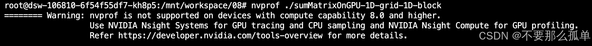

&emsp;&emsp;在内核的性能转换过程中，了解核函数的执行需要多长时间是很有帮助并且十分关键的。衡量核函数性能的方法有很多。最简单的方法是在主机端使用一个CPU或GPU计时器来计算内核的执行时间。
## 1.用CPU计时器计时
&emsp;&emsp;计时我们使用gettimeofday() 函数，是linux下的一个库函数，创建一个cpu计时器，从1970年1月1日0点以来到现在的秒数，需要头文件sys/time.h。
> 完整代码：[**https://github.com/dive-into-cuda**](https://github.com/hujianbin03/dive-into-cuda)  
```c
#include <sys/time.h>
double cpuSecond()
{
  struct timeval tp;
  gettimeofday(&tp,NULL);
  return((double)tp.tv_sec+(double)tp.tv_usec*1e-6);
}
```
&emsp;&emsp;接着使用cpuSecond函数来测试你的核函数，由于核函数调用与主机端程序是异步的，你需要用cudaDeviceSynchronize函数来等待所有的GPU线程运行结束。为了更好的测试，需要修改一下之前的程序。
* 设置数据集大小来对一个有16M个元素的大向量进行测试
	```c
	int nElem = 1 <<24;
	```
* 由于GPU的可扩展性，你需要借助块和线程的索引来计算一个按行优先的数组索引i，并对核函数进行修改，添加限定条件（i＜N）来检验索引值是否越界
	```c
	__global__ void sumArraysOnGPU(float *A, float *B, float *C, const int N)
	{
	    int i = blockId.x * blockDim.x + threadIdx.x;
	    if(i < N) 
	    {
	        C[i] = A[i] + B[i];
	    }  
	}
	```
在开始写计时代码之前，我们先来写一个头文件，放我们整个项目代码中常用的函数声明、宏定义、结构体定义等。文件名：include/utils.h
```c
#ifndef _UTILS_H
#define _UTILS_H
#define CHECK(call)                                                             \
{                                                                               \
    const cudaError_t error = call;                                             \
    if (error != cudaSuccess)                                                   \
    {                                                                           \
        printf("Error: %s:%d, ", __FILE__, __LINE__);                           \
        printf("code: %d, reason: %s\n", error, cudaGetErrorString(error));     \
        exit(1);                                                                \
    }                                                                           \
} 

#include <time.h>
#include <stdio.h>
#include <stdlib.h>
#include <math.h>
#ifdef _WIN32
#	include <windows.h>
#else
#	include <sys/time.h>
#endif

void initialData(float *ip, int size){
    // 为随机数生成不同的种子
    // time_t是一个数据类型，用于表示时间
    time_t t;
    // &t获取变量t的地址
    srand((unsigned int) time(&t));

    for (int i=0; i<size; i++){
        ip[i] = (float)(rand() & 0xFF) / 10.0f;
    }
}

double cpuSecond()
{
  struct timeval tp;
  gettimeofday(&tp,NULL);
  return((double)tp.tv_sec+(double)tp.tv_usec*1e-6);

}

void checkResult(float *hostRef, float *gpuRef, const int N){
    double epsilon = 1.0E-8 ;
    int match = 1;
    for (int i=0; i<N; i++){
        if (fabsf(hostRef[i] - gpuRef[i]) > epsilon){
            match = 0;
            printf("Arrays do not match!\n");
            printf("host %5.2f gpu %5.2f at current %d\n", hostRef[i], gpuRef[i], i);
            break;
        }
    }
    if (match){
        printf("Arrays match.\n\n");
        return;
    }
}

#endif  //_UTILS_H
```
>#ifndef 是"if not defined"的简写，是预处理功能（宏定义、文件包含、条件编译）当中的条件编译，可以根据是否已经定义了一个变量来进行分支选择，其作用是：
>>1、防止头文件的重复包含和编译；
>>2、便于程序的调试和移植；

ok， 现在来修改一下前一章写的向量加法的代码，加入计时函数（sumArraysOnGPU-timer.cu）。
```c
#include <cuda_runtime.h>
#include "../include/utils.h"


// 当a是一个指针的时候，*a就是这个指针指向的内存的值
// const含义：只要一个变量前用const来修饰，就意味着该变量里的数据只能被访问，而不能被修改，也就是意味着“只读”（readonly）
void sumArraysOnHost(float *A, float *B, float *C, const int N){
    for (int idx=0; idx<N; idx++){
        C[idx] = A[idx] + B[idx];
    }
}

__global__ void sumArraysOnGPU(float *A, float *B, float *C, const int N)
{
    int i = blockIdx.x * blockDim.x + threadIdx.x;
    if(i < N) 
    {
        C[i] = A[i] + B[i];
    }  
}

int main(int argc, char **argv){
    printf("%s 开始...\n", argv[0]);

    // 设置设备
    int dev = 0;
    cudaDeviceProp deviceProp;
    CHECK(cudaGetDeviceProperties(&deviceProp, dev));
    printf("使用设备： %d: %s\n", dev, deviceProp.name);
    CHECK(cudaSetDevice(dev));

    // 设置向量数据
    int nElem = 1<<24;
    printf("向量大小为 %d\n", nElem);

    // 主机申请内存
    size_t nBytes = nElem * sizeof(float);

    float *h_A, *h_B, *hostRef, *gpuRef;
    h_A     = (float *)malloc(nBytes);
    h_B     = (float *)malloc(nBytes);
    hostRef = (float *)malloc(nBytes);
    gpuRef  = (float *)malloc(nBytes);

    double iStart, iElaps;

    // 主机端初始化数据
    iStart = cpuSecond();
    initialData(h_A, nElem);
    initialData(h_B, nElem);
    iElaps = cpuSecond() - iStart;

    memset(hostRef, 0, nBytes);
    memset(gpuRef,  0, nBytes);

    // 主机端计算结果
    iStart = cpuSecond();
    sumArraysOnHost(h_A, h_B, hostRef, nElem);
    iElaps = cpuSecond() - iStart;

    // 设备端申请全局内存
    float *d_A, *d_B, *d_C;
    cudaMalloc((float**)&d_A, nBytes);
    cudaMalloc((float**)&d_B, nBytes);
    cudaMalloc((float**)&d_C, nBytes);

    // 将主机数据传到设备端
    cudaMemcpy(d_A, h_A, nBytes, cudaMemcpyHostToDevice);
    cudaMemcpy(d_B, h_B, nBytes, cudaMemcpyHostToDevice);

    // 在主机端设置线程块，线程格
    int iLen = 256;
    dim3 block  (iLen);
    dim3 grid   ((nElem+block.x-1)/block.x);

    iStart = cpuSecond();
    sumArraysOnGPU<<< grid, block >>>(d_A, d_B, d_C, nElem);
    cudaDeviceSynchronize();
    iElaps = cpuSecond() - iStart;
    printf("线程设置：<<<%d, %d>>> Time elapsed %f sec\n", grid.x, block.x, iElaps);

    // 复制设备端结果到主机
    cudaMemcpy(gpuRef, d_C, nBytes, cudaMemcpyDeviceToHost);

    // 对比设备端和主机端计算结果
    checkResult(hostRef, gpuRef, nElem);
    
    // 释放设备端内存
    cudaFree(d_A);
    cudaFree(d_B);
    cudaFree(d_C);

    // 释放主机端内存
    free(h_A);
    free(h_B);
    free(hostRef);
    free(gpuRef);

    return 0;
}
```

接着我们调整下我们的参数，来看看不同线程维度对速度的影响。
* 2的幂次数据量 1<<24，16兆数据：
	* 每个块256个线程
	* 每个块512个线程
	* 每个块1024个线
* 2的幂次数据量 1<<24 + 1，16兆加一个数据：
	* 每个块256个线程

&emsp;&emsp;可以看到，这三个参数的性能差距比较小，但是需要注意的是**当数据不能被完整切块的时候性能会下降很多**，这个我们可以使用一点小技巧，比如只传输可完整切割数据块，然后剩下的1，2个使用cpu计算，这种技巧后面有介绍。&emsp;&emsp;在调整执行配置时需要了解的一个关键点是对**网格和块维度的限制**。线程层次结构中每个层级的最大尺寸取决于设备。CUDA提供了通过查询GPU来了解这些限制的能力。后面有详细的介绍。
## 2.用nvprof工具计时
&emsp;&emsp;自CUDA 5.0以来，NVIDIA提供了一个名为nvprof的命令行分析工具，可以帮助从应
用程序的CPU和GPU活动情况中获取时间线信息，其包括内核执行、内存传输以及CUDA API的调用。其用法如下。
```c
$ nvprof [nvprof_args] <application>[application_args]
```
可以使用以下命令获取更多关于nvprof的帮助信息：
```c
$ nvprof --help
```
如果执行nvprof，显示下图，那可以使用NVIDIA Nsight性能工具，因为原来的性能分析工具nvprof已经迁移到NSight上了，命令选项也更名。Nsight工具主要分为nsys命令和ncu命令，前者主要分析api级别的性能时间等，后者主要分析kernel内部的带宽、活跃线程数、warp利用率等。大多数的nvprof和ncu是一样的。（因为我的电脑一直有权限问题，导致用不了ncu，之后弄好了再来补这一块的图！！！气死！）

现在用nvprof工具测试一下，上面写的计时代码：
```c
$ nvprof ./sumArraysOnGPU-timer
$ ncu ./sumArraysOnGPU-timer
```
贴一个书上的运行结果，看一下：

&emsp;&emsp;以上结果的前半部分来自于程序的输出，后半部分来自于nvprof的输出。可以注意到，CPU计时器显示消耗的内核时间为3.26ms，而nvprof显示消耗的内核时间为2.90ms。在这个例子中，nvprof的结果更为精确，因为CPU计时器测量的时间中包含了来自nvprof附加的时间。

&emsp;&emsp;对于HPC（高性能计算）工作负载，理解程序中**通信比的计算**是非常重要的。在后面，你将会学习如何使用CUDA流和事件来压缩计算量和通信量。
* 如果你的应用程序用于计算的时间大于数据传输所用的时间，那么或许可以压缩这些操作，并完全隐藏与传输数据有关的延迟。
* 如果你的应用程序用于计算的时间少于数据传输所用的时间，那么需要尽量减少主机和设备之间的传输。

### 2.1 比较应用程序的性能将理论界限最大化
&emsp;&emsp;计时只是手段，我们最终要通过计时的结果来提供优化程序的方向。在进行程序优化时，如何将应用程序和理论界限进行比较是很重要的。由nvprof得到的计数器可以帮助你获取应用程序的指令和内存吞吐量。如果将应用程序的测量值与理论峰值进行比较，可以判定你的应用程序的性能是受限于算法还是受限于内存带宽的。以Tesla K10为例，可以得到理论上的比率：
* Tesla K10单精度峰值浮点运算次数：745 MHz核心频率*2 GPU/芯片*（8个多处理器*192个浮点单元*32核心/多处理器）*2OPS/周期＝4.58 TFLOPS（FLOPS表示每秒浮点运算次数）
* Tesla K10内存带宽峰值：2 GPU/芯片*256位*2500 MHz内存时钟*2 DDR/8位/字节＝320 GB/s
* 指令比：字节4.58 TFLOPS/320 GB/s，也就是13.6个指令：1个字节

&emsp;&emsp;所以，对于Tesla K10而言，如果你的应用程序每访问一个字节所产生的指令数多于13.6，那么你的应用程序受算法性能限制。**大多数HPC工作负载受内存带宽的限制**。