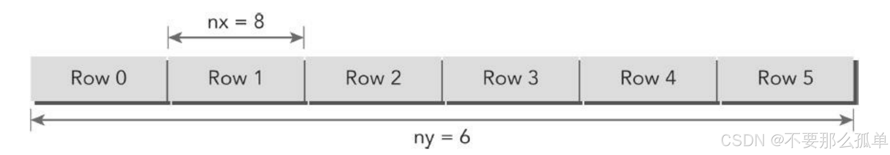
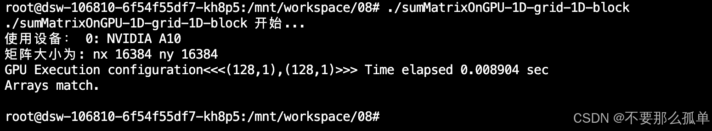
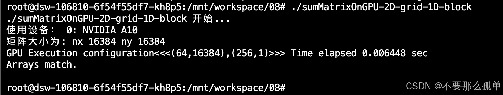

&emsp;&emsp;从前面的例子可以看出，如果使用了合适的网格和块大小来正确地组织线程，那么可以对内核性能产生很大的影响，执行时间要快很多。所以，根据**不同的数据大小，选择不同的线程块和线程格是非常重要的**。在矩阵加法中使用以下布局将有助于了解更多关于网格和块的启发性的用法：
* 由二维线程块构成的二维网格
* 由一维线程块构成的一维网格
* 由一维线程块构成的二维网格
## 1. 使用块和线程建立矩阵索引
&emsp;&emsp;通常情况下，一个矩阵用行优先的方法在全局内存中进行线性存储。下图所示的是一个8×6矩阵的小例子。
>行优先: 故名思意，当我们表示一个矩阵的时候把行放在前面就是行优先，把列放在前面就是列优先。比如 一个矩阵[m][n] ， 表示为 m行n列矩阵，表示为行优先，当表示为 m 列n行的时候就是表示列优先。


&emsp;&emsp;在一个矩阵加法核函数中，**一个线程通常被分配一个数据元素来处理**。首先要完成的任务是使用块和线程索引从全局内存中访问指定的数据。通常情况下，对一个二维示例来说，需要管理3种索引：
* 线程和块索引
* 矩阵中给定点的坐标
* 全局线性内存中的偏移量

&emsp;&emsp;之前讲过CUDA每一个线程执行相同的代码，也就是异构计算中说的多线程单指令，如果每个不同的线程执行同样的代码，又处理同一组数据，将会得到多个相同的结果，显然这是没意义的，为了让**不同线程处理不同的数据**，CUDA常用的做法是让不同的线程对应不同的数据，也就是用线程的全局标号对应不同组的数据，简单来说，就是用**线程将数据分割，每个线程都处理数据的一部分，没有空闲的线程**，所以性能会更好。
&emsp;&emsp;具体的做法：对于一个给定的线程，首先可以通过把线程和块索引映射到矩阵坐标上来获取线程块和线程索引的全局内存偏移量，然后将这些矩阵坐标映射到全局内存的存储单元中。
1. 可以用以下公式把线程和块索引映射到矩阵坐标上：
	```c
	ix=threadIdx.x+blockIdx.x*blockDim.x;
	iy=threadIdx.y+blockIdx.y*blockDim.y;
	```
2. 可以用以下公式把矩阵坐标映射到全局内存中的索引/存储单元上：
	```c
	idx=iy*nx+ix;
	```

下图可以很好的说明了块和线程索引、矩阵坐标以及线性全局内存索引之间的对应关系。这里(ix,iy)就是整个线程模型中任意一个线程的索引，或者叫做全局地址。idx就是这个线程对应要处理的数据的内存索引。
现在来写段代码，测试一下，文件名：checkThreadIndex.cu。
> 代码仓库：[https://github.com/hujianbin03/dive-into-cuda](https://github.com/hujianbin03/dive-into-cuda)
```c
#include <cuda_runtime.h>
#include "../include/utils.h"

__global__ void printThreadIndex(int *A, const int nx, const int ny){
    int ix = threadIdx.x + blockIdx.x * blockDim.x;
    int iy = threadIdx.y + blockIdx.y * blockDim.y;
    unsigned int idx = iy * nx + ix;

    printf("thread_id(%d,%d) block_id(%d,%d) coordinate(%d,%d)"
          "global index %2d ival %2d\n",threadIdx.x,threadIdx.y,
          blockIdx.x,blockIdx.y,ix,iy,idx,A[idx]);
}

int main(int argc, char **argv){
    printf("%s 开始...\n", argv[0]);

    // 设置设备
    initDevice(0);

    // 设置矩阵维度
    int nx = 8;
    int ny = 6;
    int nxy = nx * ny;
    int nBytes = nxy * sizeof(float);

    // 主机申请内存
    int *h_A;
    h_A = (int *)malloc(nBytes);

    // 初始化矩阵
    initialData_int(h_A, nxy);
    printMatrix(h_A, nx, ny);

    // 设备申请内存
    int *d_MatA;
    cudaMalloc((void **)&d_MatA, nBytes);

    // 将数据从主机端传输到设备端
    cudaMemcpy(d_MatA, h_A, nBytes, cudaMemcpyHostToDevice);

    // 设置线程块，线程格
    dim3 block(4, 2);
    dim3 grid((nx+block.x-1)/block.x, (ny+block.y-1)/block.y);

    // 执行核函数
    printThreadIndex <<<grid, block>>>(d_MatA, nx, ny);
    
    // 隐式同步
    cudaDeviceSynchronize();

    // 释放内存
    cudaFree(d_MatA);
    free(h_A);

    cudaDeviceReset();
    return 0;
} 
```
修改工具头文件，utils.h
```c
#ifndef _UTILS_H
#define _UTILS_H
#define CHECK(call)                                                             \
{                                                                               \
    const cudaError_t error = call;                                             \
    if (error != cudaSuccess)                                                   \
    {                                                                           \
        printf("Error: %s:%d, ", __FILE__, __LINE__);                           \
        printf("code: %d, reason: %s\n", error, cudaGetErrorString(error));     \
        exit(1);                                                                \
    }                                                                           \
} 

#include <time.h>
#include <stdio.h>
#include <stdlib.h>
#include <math.h>
#ifdef _WIN32
#	include <windows.h>
#else
#	include <sys/time.h>
#endif

void initialData(float *ip, int size){
    // 为随机数生成不同的种子
    // time_t是一个数据类型，用于表示时间
    time_t t;
    // &t获取变量t的地址
    srand((unsigned int) time(&t));

    for (int i=0; i<size; i++){
        ip[i] = (float)(rand()&0xff) / 10.0f;
    }
}

void initialData_int(int* ip, int size){
	time_t t;
	srand((unsigned)time(&t));
	for (int i = 0; i<size; i++)
	{
		ip[i] = int(rand()&0xff);
	}
}

void initDevice(int devNum){
  int dev = devNum;
  cudaDeviceProp deviceProp;
  CHECK(cudaGetDeviceProperties(&deviceProp,dev));
  printf("使用设备： %d: %s\n", dev, deviceProp.name);
  CHECK(cudaSetDevice(dev));
}

double cpuSecond(){
  struct timeval tp;
  gettimeofday(&tp,NULL);
  return((double)tp.tv_sec+(double)tp.tv_usec*1e-6);
}

void checkResult(float *hostRef, float *gpuRef, const int N){
    double epsilon = 1.0E-8 ;
    int match = 1;
    for (int i=0; i<N; i++){
        if (fabsf(hostRef[i] - gpuRef[i]) > epsilon){
            match = 0;
            printf("Arrays do not match!\n");
            printf("host %5.2f gpu %5.2f at current %d\n", hostRef[i], gpuRef[i], i);
            break;
        }
    }
    if (match){
        printf("Arrays match.\n\n");
        return;
    }
}

void printMatrix(int * C,const int nx,const int ny){
  int *ic=C;
  printf("Matrix<%d,%d>:\n",ny,nx);
  for(int i=0;i<ny;i++)
  {
    for(int j=0;j<nx;j++)
    {
      printf("%3d ",ic[j]);
    }
    ic+=nx;
    printf("\n");
  }
}

#endif  //_UTILS_H
```

执行结果如下，从打印信息，我们可以知道每一个线程已经对应到了不同的数据，接下来就是开始计算了。

## 2. 使用二维网格和二维块对矩阵求和
&emsp;&emsp;在本节中，我们将使用一个二维网格和二维块来编写一个矩阵加法核函数。首先，应编写一个校验主函数以验证矩阵加法核函数是否能得出正确的结果，即在主机上执行的代码。然后，创建一个新的核函数，目的是采用一个二维线程块来进行矩阵求和。矩阵大小设置和线程设置为：
```c
int nx = 1<<14;
int ny = 1<<14;

int dimx = 32; int dimy = 32;
dim3 block(dimx, dimy);
dim3 grid((nx+block.x-1)/block.x, (ny+block.y-1)/block.y);
```
全部代码如下：
```c
#include <cuda_runtime.h>
#include "../include/utils.h"

void sumMatrixOnHost(float *A, float *B, float *C, const int nx, const int ny){
    float *ia = A;
    float *ib = B;
    float *ic = C;

    for (int iy=0; iy<ny; iy++){
        for(int ix=0; ix<nx; ix++){
            ic[ix] = ia[ix] + ib[ix];
        }
        ia += nx;
        ib += nx;
        ic += nx;
    }
}

__global__ void sumMatrixOnGPU2D(float *MatA, float *MatB, float *MatC, int nx, int ny){
    unsigned int ix = threadIdx.x + blockIdx.x * blockDim.x;
    unsigned int iy = threadIdx.y + blockIdx.y * blockDim.y;
    unsigned int idx = iy * nx + ix;

    if (ix < nx && iy < ny){
        MatC[idx] = MatA[idx] + MatB[idx];
    }
}

int main(int argc, char **argv){
    printf("%s 开始...\n", argv[0]);

    // 设置设备
    initDevice(0);

    // 设置矩阵维度
    int nx = 1 <<14;
    int ny = 1 <<14;
    int nxy = nx * ny;
    int nBytes = nxy * sizeof(float);
    printf("矩阵大小为: nx %d ny %d\n", nx, ny);

    // 主机申请内存
    float *h_A, *h_B, *hostRef, *gpuRef;
    h_A = (float *)malloc(nBytes);
    h_B = (float *)malloc(nBytes);
    hostRef = (float *)malloc(nBytes);
    gpuRef = (float *)malloc(nBytes);

    // 初始化矩阵
    double iStart = cpuSecond();
    initialData(h_A, nxy);
    initialData(h_B, nxy);
    double iElaps = cpuSecond() - iStart;

    // 初始化内存
    memset(hostRef, 0, nBytes);
    memset(gpuRef, 0, nBytes);

    // 主机计算矩阵相加
    iStart = cpuSecond();
    sumMatrixOnHost(h_A, h_B, hostRef, nx, ny);
    iElaps = cpuSecond() - iStart;

    // 设备申请内存
    float *d_MatA, *d_MatB, *d_MatC;
    cudaMalloc((void **)&d_MatA, nBytes);
    cudaMalloc((void **)&d_MatB, nBytes);
    cudaMalloc((void **)&d_MatC, nBytes);

    // 将数据从主机端传输到设备端
    cudaMemcpy(d_MatA, h_A, nBytes, cudaMemcpyHostToDevice);
    cudaMemcpy(d_MatB, h_B, nBytes, cudaMemcpyHostToDevice);

    // 设置线程块，线程格
    int dimx = 32;
    int dimy = 32;
    dim3 block(dimx, dimy);
    dim3 grid((nx+block.x-1)/block.x, (ny+block.y-1)/block.y);

    // 执行核函数
    iStart = cpuSecond();
    sumMatrixOnGPU2D <<<grid, block>>>(d_MatA, d_MatB, d_MatC, nx, ny);
    cudaDeviceSynchronize();
    iElaps = cpuSecond() - iStart;
    printf("GPU Execution configuration<<<(%d,%d),(%d,%d)>>> Time elapsed %f sec\n",
        grid.x,grid.y,block.x,block.y,iElaps); 

    // 将设备端结果传到主机端
    cudaMemcpy(gpuRef, d_MatC, nBytes, cudaMemcpyDeviceToHost);

    // 对比主机和设备结果
    checkResult(hostRef, gpuRef, nxy);

    // 释放内存
    cudaFree(d_MatA);
    cudaFree(d_MatB);
    cudaFree(d_MatC);
    free(h_A);
    free(h_B);
    free(hostRef);
    free(gpuRef);

    cudaDeviceReset();
    return 0;
} 
```
修改一下内核配置(线程格，线程块)，对比一下结果，后面将会学习到为什么不同的执行配置会影响核函数的性能，现在就先来看一下。
* 矩阵(1<<14, 1<<14)，256兆数据：
	* 内核配置<<<(512, 512), (32, 32)>>>
	* 内核配置<<<(512, 1024), (32, 16)>>>
	*  内核配置<<<(1024, 1024), (16, 16)>>>
	*  内核配置<<<(4096, 4096), (4, 4)>>>
	* 内核配置<<<(128, 128), (128, 128)>>>
## 3. 使用一维网格和一维块对矩阵求和
如果使用一维网格和一维块对矩阵求和，需要修改一下核函数，其中每个线程处理ny个数据元素，如下图所示：

新写一个文件sumMatrix-OnGPU-1D-grid-1D-block.cu，新增核函数和内核配置如下，其他和上一章代码一样：
```c
__global__ void sumMatrixOnGPU1D(float *MatA, float *MatB, float *MatC, int nx, int ny){
    unsigned int ix = threadIdx.x + blockIdx.x * blockDim.x;
    if (ix < nx){
        for (int iy=0; iy<ny; iy++){
            int idx = iy * nx + ix;
            MatC[idx] = MatA[idx] + MatB[idx];
        }
    }
}
dim3 block(32, 1);
dim3 grid((nx+block.x-1)/block.x, 1);
```
* 矩阵(1<<14, 1<<14)，256兆数据：
	* 内核配置<<<(512, 1), (32, 1)>>> 
	* 内核配置<<<(128, 1), (128, 1)>>>
## 4. 使用二维网格和一维块对矩阵求和
当使用一个包含一维块的二维网格时，每个线程都只关注一个数据元素并且网格的第二个维数等于ny，如下图所示。


这可以看作是含有一个二维块的二维网格的特殊情况，其中块的第二个维数是1。因此，从块和线程索引到矩阵坐标的映射就变成：
```c
 ix = threadIdx.x + blockIdx.x * blockDim.x;
 iy = blockIdx.y;
```
新写一个文件sumMatrixOnGPU-2D-grid-1D-block.cu，新增核函数和内核配置如下，其他和上一章代码一样：
```c

```
* 矩阵(1<<14, 1<<14)，256兆数据：
	* 内核配置<<<(512, 16384), (32, 1)>>> 	
	* 内核配置<<<(64, 16384), (256, 1)>>>	

从矩阵加法的例子中可以看出：
* 改变执行配置对内核性能有影响
* 传统的核函数实现一般不能获得最佳性能
* 对于一个给定的核函数，尝试使用不同的网格和线程块大小可以获得更好的性能

所以，如何利用好我们现有的硬件实现更快的算法，是我们学习的一个关键问题。后面，我们将会从硬件的角度学习产生这些问题的原因。