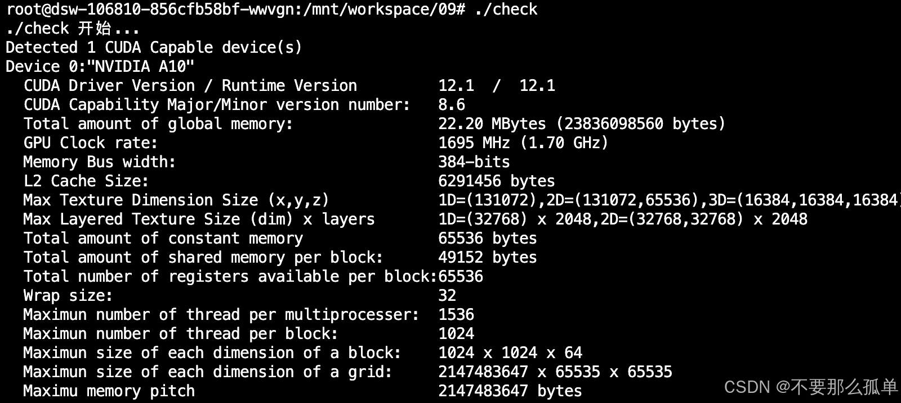

&emsp;&emsp;NVIDIA提供了几个查询和管理GPU设备的方法。学会如何查询GPU设备信息是很重要的，因为在运行时你可以使用它来帮助设置内核执行配置
## 1.使用运行时API查询GPU信息
&emsp;&emsp;在CUDA运行时API中有很多函数可以帮助管理这些设备。下面列出几个常用的API，当然更多的信息可以去查看官网，那里是最新最全的： [NVIDIA CUDA库文档4.0](https://developer.download.nvidia.cn/compute/DevZone/docs/html/C/doc/html/index.html)：
```c|
cudaError_t 	cudaChooseDevice（int *device，const struct cudaDeviceProp *prop）		//选择最符合标准的计算设备。
cudaError_t 	cudaDeviceGetCacheConfig（enum cudaFuncCache *pCacheConfig）		//返回当前设备的首选缓存配置。
cudaError_t 	cudaDeviceGetLimit (size_t *pValue, enum cudaLimit limit)		//返回资源限制。
cudaError_t 	cudaDeviceReset（void）		//销毁所有分配，并在当前流程中重置当前设备上的所有状态。
cudaError_t 	cudaDeviceSetCacheConfig（enum cudaFuncCache cacheConfig）		//设置当前设备的首选缓存配置。
cudaError_t 	cudaDeviceSetLimit (enum cudaLimit limit, size_t value)		//设置资源限制。
cudaError_t 	cudaDeviceSynchronize（void）		//等待计算设备完成。
cudaError_t 	cudaGetDevice（int *device）		//返回当前正在使用的设备。
cudaError_t 	cudaGetDeviceCount（int *count）		//返回具有计算能力的设备数量。
cudaError_t 	cudaGetDeviceProperties (struct cudaDeviceProp *prop, int device)		//返回有关计算设备的信息。
cudaError_t 	cudaSetDevice（int device）		//设置用于GPU执行的设备。
cudaError_t 	cudaSetDeviceFlags (unsigned int flags)）		//设置用于设备执行的标志。
cudaError_t 	cudaSetValidDevices（int *device_arr，int len）		//设置可用于CUDA的设备列表。
```

下面来，写一个程序：使用运行时API查询设备信息（checkDeviceInfor.cu）
> 完整代码：[**https://github.com/dive-into-cuda**](https://github.com/hujianbin03/dive-into-cuda)  
```c
#include <cuda_runtime.h>
#include <stdio.h>

int main(int argc, char **argv){
    printf("%s 开始...\n", argv[0]);

    int deviceCount = 0;
    cudaError_t error_id = cudaGetDeviceCount(&deviceCount);
    if (error_id != cudaSuccess){
        printf("cudaGetDeviceCount returned %d\n ->%s\n",
              (int)error_id,cudaGetErrorString(error_id));
        printf("Result = FAIL\n");
        exit(EXIT_FAILURE);
    }

    if (deviceCount == 0){
        printf("There are no available device(s) that support CUDA\n");
    }
    else{
        printf("Detected %d CUDA Capable device(s)\n", deviceCount);
    }

    int dev, driverVersion = 0, runtimeVersion = 0;

    dev = 0;
    cudaSetDevice(dev);
    cudaDeviceProp deviceProp;
    cudaGetDeviceProperties(&deviceProp, dev);
    printf("Device %d:\"%s\"\n",dev,deviceProp.name);

    cudaDriverGetVersion(&driverVersion);
    cudaRuntimeGetVersion(&runtimeVersion);
    printf("  CUDA Driver Version / Runtime Version         %d.%d  /  %d.%d\n",
        driverVersion/1000,(driverVersion%100)/10,
        runtimeVersion/1000,(runtimeVersion%100)/10);
    printf("  CUDA Capability Major/Minor version number:   %d.%d\n",
        deviceProp.major,deviceProp.minor);
    printf("  Total amount of global memory:                %.2f MBytes (%llu bytes)\n",
            (float)deviceProp.totalGlobalMem/pow(1024.0,3),
            (unsigned long long) deviceProp.totalGlobalMem);
    printf("  GPU Clock rate:                               %.0f MHz (%0.2f GHz)\n",
            deviceProp.clockRate*1e-3f,deviceProp.clockRate*1e-6f);
    printf("  Memory Bus width:                             %d-bits\n",
            deviceProp.memoryBusWidth);
    if (deviceProp.l2CacheSize)
    {
        printf("  L2 Cache Size:                            	%d bytes\n",
                deviceProp.l2CacheSize);
    }
    printf("  Max Texture Dimension Size (x,y,z)            1D=(%d),2D=(%d,%d),3D=(%d,%d,%d)\n",
            deviceProp.maxTexture1D,deviceProp.maxTexture2D[0],
            deviceProp.maxTexture2D[1]
            ,deviceProp.maxTexture3D[0],deviceProp.maxTexture3D[1],
            deviceProp.maxTexture3D[2]);
    printf("  Max Layered Texture Size (dim) x layers       1D=(%d) x %d,2D=(%d,%d) x %d\n",
            deviceProp.maxTexture1DLayered[0],deviceProp.maxTexture1DLayered[1],
            deviceProp.maxTexture2DLayered[0],deviceProp.maxTexture2DLayered[1],
            deviceProp.maxTexture2DLayered[2]);
    printf("  Total amount of constant memory               %lu bytes\n",
            deviceProp.totalConstMem);
    printf("  Total amount of shared memory per block:      %lu bytes\n",
            deviceProp.sharedMemPerBlock);
    printf("  Total number of registers available per block:%d\n",
            deviceProp.regsPerBlock);
    printf("  Wrap size:                                    %d\n",deviceProp.warpSize);
    printf("  Maximun number of thread per multiprocesser:  %d\n",
            deviceProp.maxThreadsPerMultiProcessor);
    printf("  Maximun number of thread per block:           %d\n",
            deviceProp.maxThreadsPerBlock);
    printf("  Maximun size of each dimension of a block:    %d x %d x %d\n",
            deviceProp.maxThreadsDim[0],
            deviceProp.maxThreadsDim[1],
            deviceProp.maxThreadsDim[2]);
    printf("  Maximun size of each dimension of a grid:     %d x %d x %d\n",
            deviceProp.maxGridSize[0],
	        deviceProp.maxGridSize[1],
	        deviceProp.maxGridSize[2]);
    printf("  Maximu memory pitch                           %lu bytes\n",deviceProp.memPitch);
    exit(EXIT_SUCCESS);
}
```
输出如下：

这些信息含义，很多后面会讲，且对GPU性能有影响：
>CUDA Driver Version / Runtime Version：cuda驱动版本/运行时版本。
major,minor：定义设备计算能力的主要和次要修订号。
totalGlobalMem：设备上可用的全局内存总量（以字节为单位）。
clockRate：GPU主频（以千赫为单位）。
memoryBusWidth：GPU带宽（以位为单位）。
l2CacheSize：L2缓存大小（以字节为单位）。
maxTexture1D...：最大1D纹理尺寸。还有不同维度下的。
maxTexture1DLayered...：最大1D分层纹理尺寸（数组，包含2个元素）。还有不同维度下的。
totalConstMem：设备上可用的常量内存总量（以字节为单位）。
sharedMemPerBlock：线程块可用的最大共享内存量（以字节为单位）。
regsPerBlock：线程块可用的最大32位寄存器数量。
warpSize：线程束（warp）大小（以线程数为单位）。
maxThreadsPerMultiProcessor：每个多处理器的最大常驻线程数。
maxThreadsPerBlock：每个块中的最大线程数。
maxThreadsDim：块的每个维度的最大尺寸（数组，包含3个元素）。
maxGridSize：网格的每个维度的最大尺寸（数组，包含3个元素）。
memPitch：由cudaMallocPitch()分配的内存区域允许的最大pitch（以字节为单位）。
## 2.确定最优GPU
&emsp;&emsp;一些系统支持多GPU。在每个GPU都不同的情况下，选择性能最好的GPU运行核函数是非常重要的。通过比较GPU包含的多处理器的数量选出计算能力最佳的GPU。如果你有一个多GPU系统，可以使用以下代码来选择计算能力最优的设备。因为我的只有一个GPU，就没有测试了，多U的可以试试。
```c
// The best computing power
void getTheBestComputerPowDevice(){
    int numDevices = 0;
    cudaGetDeviceCount(&numDevices);
    if (numDevices > 1){
        int maxMultiprocessors = 0, maxDevice = 0;
        for (int device=0; device<numDevices; device++){
            cudaDeviceProp props;
            cudaGetDeviceProperties(&props, device);
            if (maxMultiprocessors < props.multiProcessorCount){
                maxMultiprocessors = props.multiProcessorCount;
                maxDevice = device;
            }
        }
        printf("计算能力最优的gpu编号: %d\n", maxDevice);
        cudaSetDevice(maxDevice);
    }
    else{
        printf("设备只有一个gpu: %d\n", numDevices);
        cudaSetDevice(numDevices);
    }
}
```
## 3.使用nvidia-smi查询GPU信息
&emsp;&emsp;nvidia-smi是一个命令行工具，用于管理和监控GPU设备，并允许查询和修改设备状态。例如，要确定系统中安装了多少个GPU以及每个GPU的设备ID，可以使用以下命令：
```c
nvidia-smi -L
```


nvidia-smi -q -i 0 加下面这些参数，可以精简nvidia-smi的显示信息。
* MEMORY
* UTILIZATION
* ECC
* TEMPERATURE
* POWER
* CLOCK
* COMPUTE
* PIDS
* PERFORMANCE
* SUPPORTED_CLOCKS
* PAGE_RETIREMENT
* ACCOUNTING

比如我们想得到内存信息，也可以只显示最后几条：
```c
nvidia-smi -q -i 0 -d MEMORY | tail -n 5
```
## 4.在运行时设置设备
&emsp;&emsp;支持多GPU的系统是很常见的。对于一个有N个GPU的系统，nvidia-smi从0到N―1标记设备ID。使用环境变量CUDA_VISIBLE_DEVICES，就可以在运行时指定所选的GPU且无须更改应用程序。
&emsp;&emsp;设置运行时环境变量CUDA_VISIBLE_DEVICES=2。nvidia驱动程序会屏蔽其他GPU，这时设备2作为设备0出现在应用程序中。也可以设置CUDA_VISIBLE_DEVICES=2，3。然后，在运行时，nvidia驱动程序将只使用ID为2和3的设备，并且会将设备ID分别映射为0和1。
## 5.总结
&emsp;&emsp;CUDA编程中独特的线程模型设计，使得我们可以充分的发挥GPU性能，使得每个线程执行相同的程序，处理不同的数据。所以，如何更好的设置网格和线程块的尺寸？即如何组织线程是CUDA编程的重点之一。对于内核执行来说网格和线程块代表了线程布局的逻辑视角。在后面的章节，我们将会从硬件视角研究相同的问题，加深对网格和线程块的理解。
