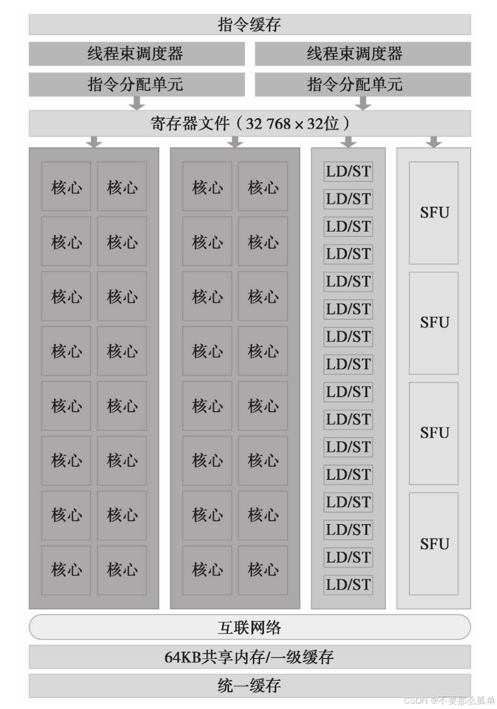
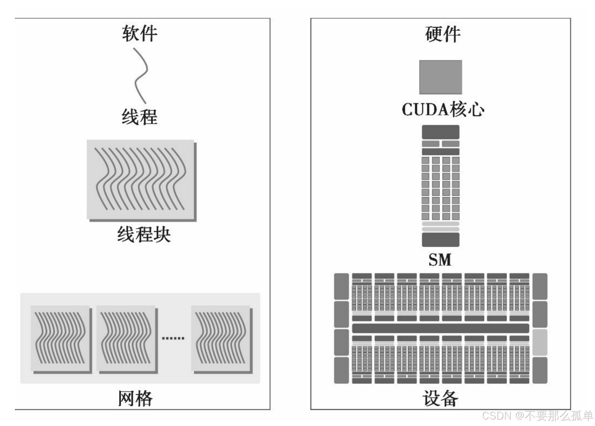
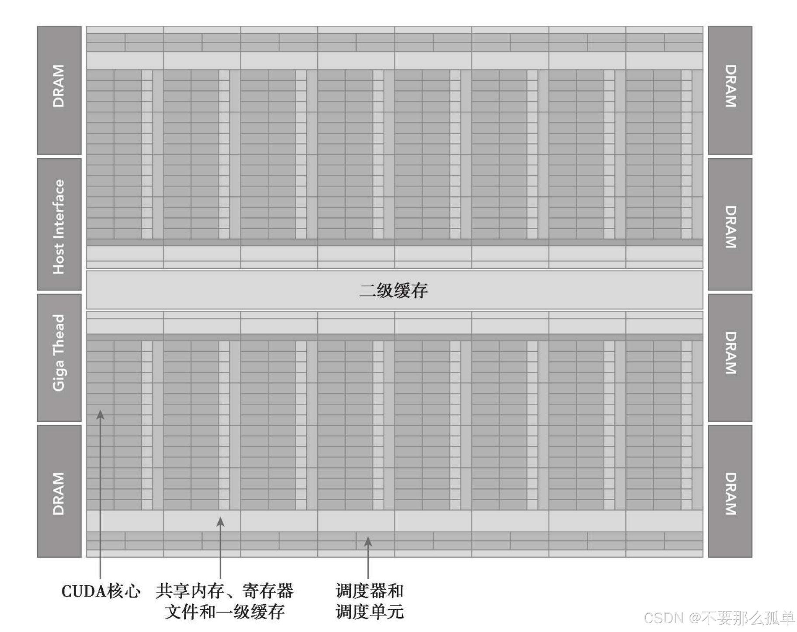
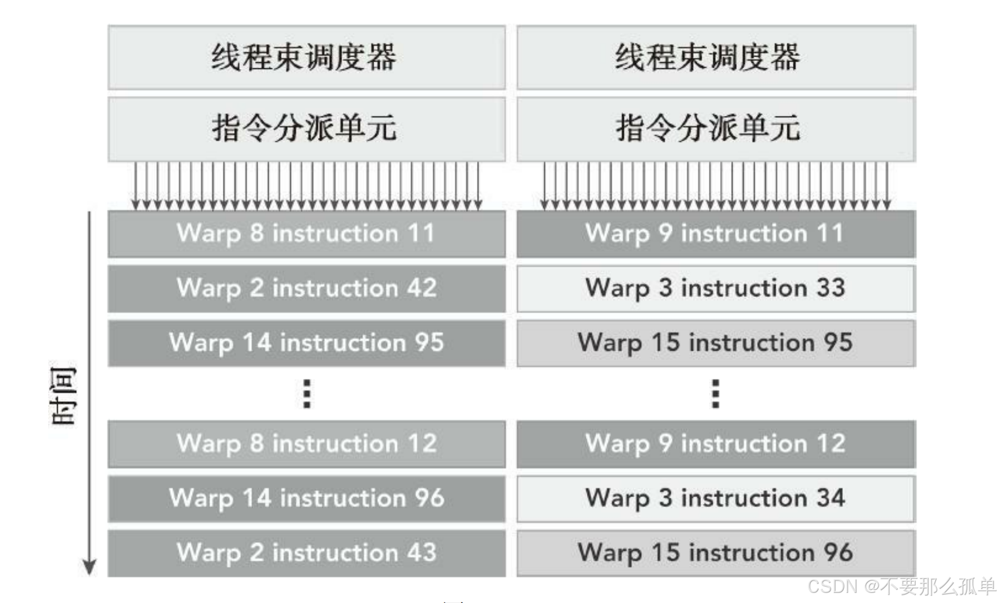
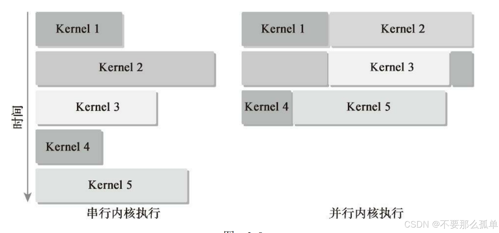
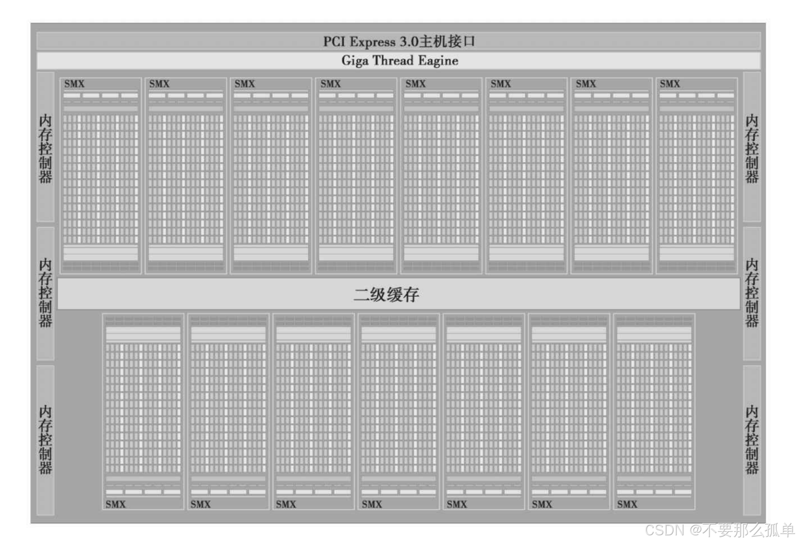
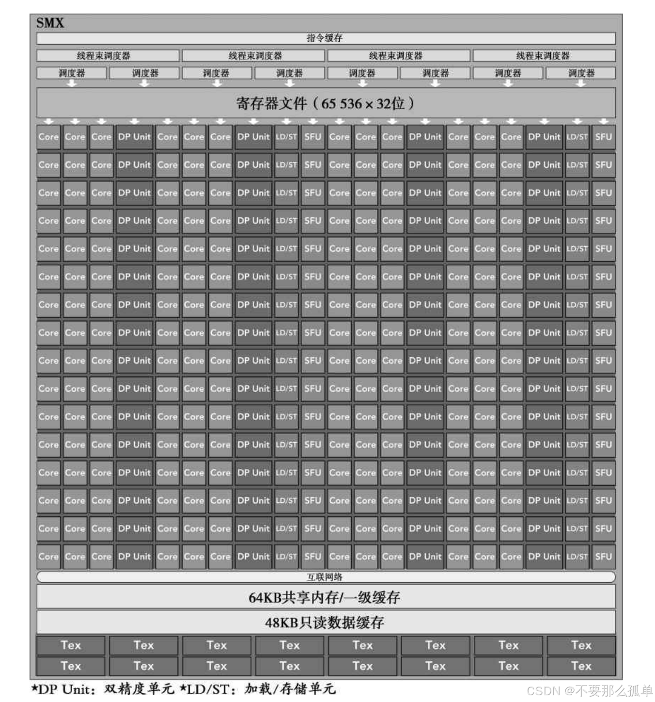
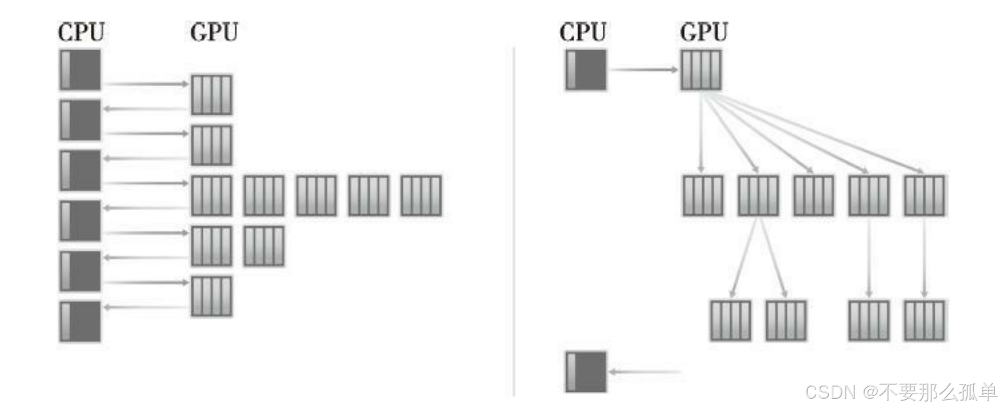
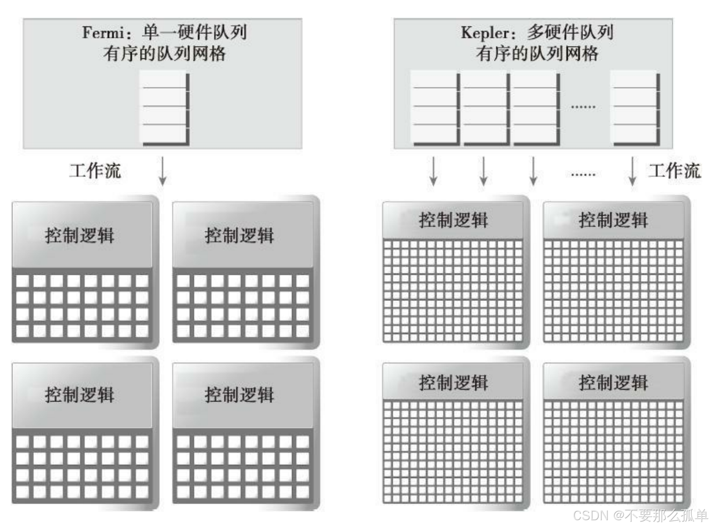

&emsp;&emsp;接下来我们开始讲GPU硬件部分和执行模型，GPU能够在并行领域中取得领先，离不了硬件的支持，这也是我们要理解和学习GPU的重点。前面几篇我们学了编写，启动核函数，计时，统计时间，然后学习了线程，内存模型，线程内存部分我们会在后面用几章的篇幅进行更详细的介绍，而本章，我们从硬件方面深入介绍内核启动配置和性能分析的信息。

CUDA中有两个很重要的模型概念。
* CUDA编程模型：**主要作用在写代码、编译的过程**，让我们可以很方便的利用多种语言，更好的控制GPU，并编译出GPU可以理解的代码。其中两个主要的抽象概念：内存层次结构和线程层次结构。
* CUDA执行模型：**主要作用在写好代码，执行的过程，即将代码作用到硬件的过程**，有助于在指令吞吐量和内存访问方面提高代码效率。

## 1. GPU架构概述
&emsp;&emsp;GPU架构是围绕一个流式多处理器（SM）的扩展阵列搭建的。通过复制这种结构来实现GPU的硬件并行。相同架构的GPU包含的SM数量通常代表了GPU的性能定位，有的低端GPU配备了1个SM，部分高端GPU则可以拥有多达数百个SM。而GPU类型则定义了这些SM的功能。SM结构下又会细分出不同的功能区域以及核心，这里简单介绍最重要的组成之一：流处理器。

&emsp;&emsp;流处理器（Streaming Processor ，简称SP）是GPU最基本的处理单元。每个SM中包含多个SP，由GPU架构决定其功能区别。我们所说的GPU中有几千个核心或者cuda单元中，这个几千指的就是流处理器的数量。**流处理器只相当于CPU处理器中的执行单元，负责执行指令进行运算，并不包含控制单元（GPU的控制单元为Warp与指令调度单元）**。

&emsp;&emsp;当启动一个内核网格时，它的线程块被分布在了可用的SM上来执行。线程块一旦被调度到一个SM上，其中的线程只会在那个指定的SM上并发执行，直到执行完成。多个线程块可能会被分配到同一个SM上，而且是根据SM资源的可用性进行调度的。

Fermi SM的关键组件，如下图所示：
* CUDA核心
* 共享内存/一级缓存
* 寄存器文件
* 加载/存储单元
* 特殊功能单元
* 线程束调度器

### 1.1 线程束
&emsp;&emsp;CUDA采用单指令多线程（SIMT）架构来管理和执行线程，每32个线程为一组，被称为线程束（warp）。线程束中的所有线程同时执行相同的指令。每个线程都有自己的指令地址计数器和寄存器状态，利用自身的数据执行当前的指令。

&emsp;&emsp;每个SM上有多个block，一个block有多个线程，但在执行的时候，在某时刻T，SM上只执行一个线程束，也就是32个线程在同时同步执行，所以**SM并不是按照block执行的，而是按照线程束执行的**。
### 1.2 SIMD vs SIMT
&emsp;&emsp;SIMT架构与SIMD（单指令多数据）架构相似。两者都是将相同的指令广播给多个执行单元来实现并行。一个关键的区别是SIMD要求同一个向量中的所有元素要在一个统一的同步组中一起执行，而SIMT允许属于同一线程束的多个线程独立执行。尽管一个线程束中的所有线程在相同的程序地址上同时开始执行，但是单独的线程仍有可能有不同的行为。**SIMT确保可以编写独立的线程级并行代码、标量线程以及用于协调线程的数据并行代码**。总结来说，就是SIMT保证了线程级别的并行，而SIMD更像是指令级别的并行。

SIMT模型包含3个SIMD所不具备的关键特征。
* 每个线程都有自己的指令地址计数器
* 每个线程都有自己的寄存器状态
* 每个线程可以有一个独立的执行路径
### 1.3 一个神奇的数字：32
&emsp;&emsp;32在CUDA程序里是一个神奇的数字。它来自于硬件系统，也对软件的性能有着重要的影响。从概念上讲，它是SM用SIMD方式所同时处理的工作粒度。可以这么理解：一个SM上在某一个时刻，有32个线程在执行同一条指令，这32个线程可以选择性执行，虽然有些可以不执行，但是它也不能执行别的指令，需要执行这条指令的线程束整个执行完，然后再继续下一条指令。

### 1.4 CUDA编程的组件与逻辑
下图从逻辑视图和硬件视图的角度描述了CUDA编程对应的组件。

&emsp;&emsp;在SM中，共享内存和寄存器是非常重要的资源。共享内存被分配在SM上的常驻线程块中，寄存器在线程中被分配。线程块中的线程通过这些资源可以进行相互的合作和通信。

&emsp;&emsp;尽管线程块里的所有线程都可以逻辑地并行运行，但是并不是所有线程都可以同时在物理层面执行。因此，线程块里的不同线程可能会以不同的速度前进，但是同一个线程束内的线程拥有相同的进度。在并行线程中共享数据可能会引起竞争：多个线程使用未定义的顺序访问同一个数据，从而导致不可预测的程序行为。CUDA提供了一种用来同步线程块里的线程的方法，不用我们来操心，而且也并没有提供控制的接口。

&emsp;&emsp;在并发的线程束间切换并没有开销，当线程束由于任何理由闲置的时候（如等待从设备内存中读取数值），SM可以从同一SM上的常驻线程块中调度其他可用的线程束。

### 1.5 SM：GPU架构的核心
&emsp;&emsp;SM是GPU架构的核心。寄存器和共享内存是SM中的稀缺资源。CUDA将这些资源分配到SM中的所有常驻线程里。因此，这些有限的资源限制了在SM上活跃的线程束数量，活跃的线程束数量对应于SM上的并行量。了解一些SM硬件组成的基本知识，有助于组织线程和配置内核执行以获得最佳的性能。
## 2. Fermi架构
&emsp;&emsp;Fermi架构是第一个完整的GPU计算架构，所以了解这个架构是非常有必要的。通过学习它们的硬件特征，这有助于提高对内核性能的理解。

Fermi架构逻辑图如上，具体数据如下:

* **CUDA核心**：多达512个加速器核心（CUDA核心），每个CUDA核心都有一个全流水线的整数算术逻辑单元（ALU）和一个浮点运算单元（FPU）。每个时钟周期执行一个整数或是浮点数指令。
* **SM**：CUDA核心被组织到16个SM中，每一个SM中含有32个CUDA核心。
* **DRAM**：6个384-bits的GDDR5 的内存接口，支持6G的全局内存。
* **Host Interface**：主机接口通过PCIe总线将GPU与CPU相连。
* **Giga Thread**：全局调度器，用来分配线程块到SM线程束调度器上。

&emsp;&emsp;Fermi架构包含一个耦合的768KB的二级缓存，被16个SM所共享，一个垂直矩形条表示一个SM。一个垂直矩形条表示一个SM，包含了以下内容：

* 执行单元（CUDA核）。
* 两个线程束调度器和两个指令调度单元。当一个线程块被指定给一个SM时，线程块中的所有线程被分成了线程束。两个线程束调度器选择两个线程束，再把一个指令从线程束中发送到一个组上，组里有16个CUDA核心、16个加载/存储单元或4个特殊功能单元（如下图所示）。
* 共享内存，寄存器文件和一级缓存。
* 16个加载/存储单元（如下图所示），允许每个时钟周期内有16个线程（线程束的一半）计算源地址和目的地址。
* 特殊功能单元（SFU）执行固有指令，如正弦、余弦、平方根和插值。每个SFU在每个时钟周期内的每个线程上执行一个固有指令。

&emsp;&emsp;Fermi架构，计算性能2.x，可以在每个SM上同时处理48个线程束，即可在一个SM上同时常驻1536个线程。

&emsp;&emsp;Fermi架构的一个关键特征是有一个64KB的片内可配置存储器，它在共享内存与一级缓存之间进分配。对于许多高性能的应用程序，共享内存是影响性能的一个关键因素。CUDA提供了一个运行时API，它可以用来调整共享内存和一级缓存的数量。根据给定的内核中共享内存或缓存的使用修改片内存储器的配置，可以提高性能，这个后面会讲到。

Fermi上支持同时并发执行内核。并发执行内核允许执行一些小的内核程序来充分利用GPU，如图：

## 3. Kepler架构
&emsp;&emsp;发布于2012年秋季的Kepler GPU架构是一种快速、高效、高性能的计算架构。Kepler的特点使得混合计算更容易理解。下图表示了Kepler K20X芯片框图，它包含了**15个SM和6个64位的内存控制器**。以下是Kepler架构的3个重要的创新。
* 强化的SM
* 动态并行
* Hyper-Q技术

Kepler架构的特点：
* **一个新的SM单元**：其包括一些结构的创新，每个Kepler SM单元包含192个单精度CUDA核心，64个双精度单元，32个特殊功能单元（SFU）以及32个加载/存储单元（LD/ST），每个Kepler SM包括4个线程束调度器和8个指令调度器，其结构如下图
* **常驻线程**：Kepler K20X架构（计算能力3.5）可以同时在每个SM上调度64个线程束，即在一个SM上可同时常驻2048个线程。
* **寄存器**：K20X架构中寄存器文件容量达到64KB，同时，K20X还允许片内存储器在共享内存和一级缓存间有更多的分区。
* **功率效率**：K20X能够提供超过1TFlop的峰值双精度计算能力，相较于Fermi的设计，功率效率提高了80%，每瓦的性能也提升了三倍。
* **动态并行**：是Kepler GPU的一个新特性，它允许GPU动态启动新的网格。有了这个特点，任一内核都能启动其他的内核，并且管理任何核间需要的依赖关系来正确地执行附加的工作。这一特点也让你更容易创建和优化递归及与数据相关的执行模式。如下图所示，它展示了没有动态并行时主机在GPU上启动每一个内核时的情况；有了动态并行，GPU能够启动嵌套内核，消除了与CPU通信的需求。
* **硬件连接**：Hyper-Q技术增加了更多的CPU和GPU之间的同步硬件连接，以确保CPU核心能够在GPU上同时运行更多的任务。如下图所示，Kepler GPU在主机与GPU之间提供了32个硬件工作队列。Hyper-Q保证了在GPU上有更多的并发执行，最大限度地提高了GPU的利用并提高了整体的性能。
## 4. 使用配置文件优化程序
性能分析是通过检测来分析程序性能的行为：
* 应用程序代码的空间（内存）或时间复杂度
* 特殊指令的使用
* 函数调用的频率和持续时间

&emsp;&emsp;性能分析是程序开发中的关键一步，特别是对于优化HPC应用程序代码。性能分析往往需要对平台的执行模型有一个基本的理解以制定应用程序的优化方法。开发一个HPC应用程序通常包括两个主要步骤：
1. 提高代码的正确性。
2. 提高代码的性能。

使用配置文件的原因主要有以下几个方面。
* 一个单纯的内核应用一般不会产生最佳的性能。性能分析工具能帮助你找到代码中
影响性能的关键部分，也就是性能瓶颈。
* CUDA将SM中的计算资源在该SM中的多个常驻线程块之间进行分配。这种分配形式
导致一些资源成为了性能限制者。性能分析工具能帮助我们理解计算资源是如何被利用
的。
* CUDA提供了一个硬件架构的抽象，它能够让用户控制线程并发。性能分析工具可
以检测和优化，并将优化可视化。

CUDA提供了两个主要的性能分析工具：
* nvvp，独立的可视化分析器。
* nvprof，命令行分析器。

**因为原来的性能分析工具nvprof已经迁移到NVIDIA NSight上了，NSight也提供可视化分析工具，所以后续会nvprof和NSight都讲一下，当然重点还是最新的NSight**。

Nsight是NVIDIA面相开发者提供的开发工具套件，能提供深入的跟踪、调试、评测和分析，以优化跨 NVIDIA GPU和CPU的复杂计算应用程序。Nsight主要包含Nsight System、Nsight Compute、Nsight Graphics三部分。我们主要是用Nsight System。

* Nsight System
所有与NVIDIA GPU相关的程序开发都可以从Nsight System开始以确定最大的优化机会。Nsight System给开发者一个系统级别的应用程序性能的可视化分析。开发人员可以优化瓶颈，以便在任意数量或大小的CPU和GPU之间实现高效扩展。详情可访问 [NVIDIA官网](https://developer.nvidia.cn/tools-overview)。

Nsight System命令主要分为：
* nsys：分析api级别的性能时间。
* ncu：分析kernel内部的带宽、活跃线程数、warp利用率等。

在CUDA性能分析中，事件是可计算的活动，它对应一个在内核执行期间被收集的硬件计数器。指标是内核的特征，它由一个或多个事件计算得到。

有3种常见的限制内核性能的因素：
* 存储带宽
* 计算资源
* 指令和内存延迟