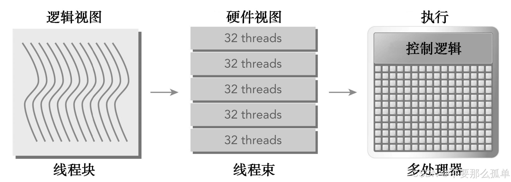

&emsp;&emsp;前面已经大概的介绍了CUDA执行模型的大概过程，硬件的大概结构，例如SM的大概结构，而对于硬件来说，CUDA执行的实质是线程束的执行。从软件的角度看，cuda执行中似乎所有的线程都是并行地运行的。在逻辑上这是正确的，但从硬件的角度来看，实际上硬件资源是有限的，不是所有线程在物理上都可以同时并行地执行。现在从硬件的角度来介绍**线程束执行**，了解执行的硬件过程是有必要的。
## 1.线程束和线程块
&emsp;&emsp;线程束是SM中基本的执行单元。当一个网格被启动（网格被启动，等价于一个内核被启动，每个内核对应于自己的网格），网格中包含线程块，线程块被分配到某一个SM上以后，将分为多个线程束，每个线程束一般是32个线程，在一个线程束中，所有的线程按照单指令多线程（SIMT）方式执行；也就是说，所有线程都执行相同的指令，每个线程在私有数据上进行操作。下图展示了线程块的逻辑视图和硬件视图之间的关系。
* 逻辑视图：即我们软件的逻辑视角，我们是通过启动核函数来调用cuda执行并行程序的，而我们启动核函数，只指定了线程格和线程块的数量。
* 硬件视图：即硬件根据软件的指令执行的视角，硬件是已经设定好的，不需要我们过多操心的，但理解它的执行过程有助于我们更好的控制cuda.

&emsp;&emsp;在计算机里，内存总是一维线性存在的，所以程序执行起来也是一维的访问线程块中的线程，但是我们在写程序的时候却可以以二维三维的方式进行，原因是方便我们写程序。在一个线程块中，每个线程都有一个唯一的ID。例如，一个有128个线程的一维线程块被组织到4个线程里，如下所示。

&emsp;&emsp;对于一维的线程块，唯一的线程ID被存储在CUDA的内置变量threadIdx.x中当。当线程块使用三维编号时，x位于最内层，y位于中层，z位于最外层，所以对于一个给定的二维线程块，在一个块中每个线程的独特标识符都可以用内置变量threadIdx和blockDim来计算：
```c
threadIdx.y * blockDim.x + threadIdx.x
```
&emsp;&emsp;对于一个三维线程块，计算如下：
```c
threadIdx.z * blockDim.y * blockDim.x + threadIdx.y * blockDim.x + threadIdx.x
```
&emsp;&emsp;一个线程块的线程束的数量可以根据下式确定：
$$
\text{一个线程块中线程束的数量}=\text{ceil}\begin{pmatrix}\frac{\text{一个线程块中线程的数量}}{\text{线程束大小}}\end{pmatrix}
$$
>ceil函数：是向正无穷取整的函数，即向上取整。

&emsp;&emsp;因此，硬件总是给一个线程块分配一定数量的线程束。**线程束不会在不同的线程块之间分离**。如果线程块的大小不是线程束大小的偶数倍，那么在最后的线程束里有些线程就不会活跃。例如下图是一个在x轴中有40个线程、在y轴中有2个线程的二维线程块。从应用程序的角度来看，在一个二维网格中共有80个线程。硬件为这个线程块配置了3个线程束，使总共96个硬件线程去支持80个软件线程。注意，最后半个线程束是不活跃的。即使这些线程未被使用，它们仍然消耗SM的资源，如寄存器等。

### 1.1 线程块：逻辑角度与硬件角度
* 从逻辑角度来看：线程块是线程的集合，它们可以被组织为一维、二维或三维布局。
* 从硬件角度来看：线程块是一维线程束的集合。在线程块中线程被组织成一维布局，每32个连续线程组成一个线程束。

## 2.线程束分化
&emsp;&emsp;控制流是高级编程语言的基本构造中的一种。GPU支持传统的、C风格的、显式的控制流结构，例如，if…then…else、for和while。

&emsp;&emsp;CPU拥有复杂的硬件以**执行分支预测**，也就是在每个条件检查中预测应用程序的控制流会使用哪个分支。如果预测正确，CPU中的分支只需付出很小的性能代价。如果预测不正确，CPU可能会停止运行很多个周期，因为指令流水线被清空了。

&emsp;&emsp;GPU是相对简单的设备，它没有复杂的分支预测机制。一个线程束中的所有线程在同一周期中必须执行相同的指令，如果一个线程执行一条指令，那么线程束中的所有线程都必须执行该指令。如果在同一线程束中的线程使用不同的路径通过同一个应用程序，这可能会产生问题。例如，思考下面的语句：
```c
if (con)
{
    //do something
}
else
{
    //do something
}
```

&emsp;&emsp;假设这段代码是核函数的一部分，那么当一个线程束的32个线程执行这段代码的时候，如果其中16个执行if中的代码段，而另外16个执行else中的代码块，同一个线程束中的线程，执行不同的指令，这叫做线程束的分化。我们已经知道，在一个线程束中所有线程在每个周期中必须执行相同的指令，所以线程束分化似乎会产生一个悖论。

&emsp;&emsp;如果一个线程束中的线程产生分化，线程束将连续执行每一个分支路径，而禁用不执行这一路径的线程。线程束分化会导致性能明显地下降。在前面的例子中可以看到，线程束中并行线程的数量减少了一半：只有16个线程同时活跃地执行，而其他16个被禁用了。**条件分支越多，并行性削弱越严重**。

&emsp;&emsp;注意，**线程束分化只发生在同一个线程束中。在不同的线程束中，不同的条件值不会引起线程束分化**。下图显示了线程束分化。

&emsp;&emsp;为了获得最佳的性能，**应该避免在同一线程束中有不同的执行路径**。请记住，在一个线程块中，线程的线程束分配是确定的。因此，以这样的方式对数据进行分区是可行的（尽管不是微不足道的，但取决于算法），以确保同一个线程束中的所有线程在一个应用程序中使用同一个控制路径。

&emsp;&emsp;现在我们来举个例子，即通过奇偶进入不同的分支执行逻辑，看下如何通过代码来避免线程束分化。先来写一个会造成分化的核函数。我们假设只配置一个x=64的一维线程块，那么只有两个个线程束，线程束内奇数线程（threadIdx.x为奇数）会执行else，偶数线程执行if，分化很严重。
```c
__global__ void mathKernel1(float *c){
    int tid = blockIdx.x * blockDim.x + threadIdx.x;
    float a, b;
    a = b = 0.0f;

    if (tid % 2 == 0){
        a = 100.0f;
    }
    else{
        b = 200.0f;
    }
    c[tid] = a + b;
}
```
&emsp;&emsp;如果使用线程束方法（而不是线程方法）来交叉存取数据，可以避免线程束分化，并且设备的利用率可达到100%。条件（tid/warpSize）%2==0使分支粒度是线程束大小的倍数；偶数编号的线程执行if子句，奇数编号的线程执行else子句。这个核函数产生相同的输出，但是顺序不同。
第一个线程束内的线程编号tid从0到31，tid/warpSize都等于0，那么就都执行if语句。
第二个线程束内的线程编号tid从32到63，tid/warpSize都等于1，执行else
线程束内没有分支，效率较高。
```c
__global__ void mathKernel2(float *c){
    int tid = blockIdx.x * blockDim.x + threadIdx.x;
    float a, b;
    a = b = 0.0f;

    if ((tid / warpSize) % 2 == 0){
        a = 100.0f;
    }
    else{
        b = 200.0f;
    }
    c[tid] = a + b;
}
```
完整代码：[https://github.com/hujianbin03/dive-into-cuda](https://github.com/hujianbin03/dive-into-cuda)
```c
#include <cuda_runtime.h>
#include "../include/utils.h"

__global__ void warmingup(float *c){
    int tid = blockIdx.x * blockDim.x + threadIdx.x;
    float a, b;
    a = b = 0.0f;

    if((tid/warpSize) % 2 == 0){
        a = 100.0f;
    }
    else{
        b = 200.0f;
    }
    c[tid] = a + b;
}

__global__ void mathKernel1(float *c){
    int tid = blockIdx.x * blockDim.x + threadIdx.x;
    float a, b;
    a = b = 0.0f;

    if (tid % 2 == 0){
        a = 100.0f;
    }
    else{
        b = 200.0f;
    }
    c[tid] = a + b;
}

__global__ void mathKernel2(float *c){
    int tid = blockIdx.x * blockDim.x + threadIdx.x;
    float a, b;
    a = b = 0.0f;

    if ((tid / warpSize) % 2 == 0){
        a = 100.0f;
    }
    else{
        b = 200.0f;
    }
    c[tid] = a + b;
}

__global__ void mathKernel3(float *c){
    int tid = blockIdx.x * blockDim.x + threadIdx.x;
    float a, b;
    a = b = 0.0f;

    bool ipred = (tid % 2 == 0);
    if (ipred){
        a = 100.0f;
    }
    else{
        b = 200.0f;
    }
    c[tid] = a + b;
}

__global__ void mathKernel4(float *c){
    int tid = blockIdx.x * blockDim.x + threadIdx.x;
    float a, b;
    a = b = 0.0f;

    int itid = tid >> 5;

    if (itid & 0x01 == 0)
    {
        a = 100.0f;
    }
    else
    {
        b = 200.0f;
    }

    c[tid] = a + b;
}

int main(int argc, char **argv){
    // 设置设备
    int dev = 0;
    cudaDeviceProp deviceProp;
    cudaGetDeviceProperties(&deviceProp, dev);
    printf("%s 使用设备 %d: %s\n", argv[0], dev, deviceProp.name);

    // 设置数据
    int size = 64;
    int blocksize = 64;
    if(argc > 1) blocksize = atoi(argv[1]);
    if(argc > 2) size      = atoi(argv[2]);
    printf("数据大小： %d\n", size);

    // 设置线程格、块
    dim3 block (blocksize, 1);
    dim3 grid  ((size+block.x-1)/block.x,1);
    printf("内核配置为：(block %d grid %d)\n", block.x, grid.x);

    // gpu申请内存
    float *d_C;
    size_t nBytes = size * sizeof(float);
    cudaMalloc((float**)&d_C, nBytes);

    // 执行warmup消除开销
    double iStart, iElaps;
    cudaDeviceSynchronize();
    iStart = seconds();
    warmingup<<<grid, block>>>(d_C);
    cudaDeviceSynchronize();
    iElaps = seconds() - iStart;
    printf("warmup          <<< %4d %4d >>> 消耗时间 %lf sec\n", grid.x, block.x, iElaps);

    // 执行mathkernel1
    iStart = seconds();
    mathKernel1<<<grid, block>>>(d_C);
    cudaDeviceSynchronize();
    iElaps = seconds() - iStart;
    printf("mathkernel1     <<< %4d %4d >>> 消耗时间 %lf sec\n", grid.x, block.x, iElaps);

    // 执行mathkernel2
    iStart = seconds();
    mathKernel2<<<grid, block>>>(d_C);
    cudaDeviceSynchronize();
    iElaps = seconds() - iStart;
    printf("mathKernel2     <<< %4d %4d >>> 消耗时间 %lf sec\n", grid.x, block.x, iElaps);

     // 执行mathkernel3
    iStart = seconds();
    mathKernel3<<<grid, block>>>(d_C);
    cudaDeviceSynchronize();
    iElaps = seconds() - iStart;
    printf("mathKernel3     <<< %4d %4d >>> 消耗时间 %lf sec\n", grid.x, block.x, iElaps);

    // 执行mathkernel4
    iStart = seconds();
    mathKernel4<<<grid, block>>>(d_C);
    cudaDeviceSynchronize();
    iElaps = seconds() - iStart;
    printf("mathKernel4     <<< %4d %4d >>> 消耗时间 %lf sec\n", grid.x, block.x, iElaps);

    //释放内存
    cudaFree(d_C);
    cudaDeviceReset();
    return EXIT_SUCCESS;    
}
```
执行结果如下：

&emsp;&emsp;代码中warmup部分是提前启动一次GPU，因为第一次启动GPU时会比第二次速度慢一些。现在来使用nvprof分析器，可以从GPU中获得指标，从而可以直接观察到线程束分化。
```c
nvprof --metrics branch_efficiency ./simpleDivergence
```

&emsp;&emsp;分支效率：为未分化的分支与全部分支之比，可以看到这里面所有kernel的分支效率都是100%，可以使用以下公式来计算：：

$$
\text{分支效率}=\text{100}\times\frac{\text{分支数 − 分化分支数}}{\text{分支数}}
$$

&emsp;&emsp;奇怪的是，没有报告显示出有分支分化（即分支效率是100%）。这个奇怪的现象是**CUDA编译器优化导致的结果，它将短的、有条件的代码段的断定指令取代了分支指令（导致分化的实际控制流指令）**。但是下面我们用另一种方式，编译器就不会优化了：
```c
__global__ void mathKernel3(float *c){
    int tid = blockIdx.x * blockDim.x + threadIdx.x;
    float a, b;
    a = b = 0.0f;

    bool ipred = (tid % 2 == 0);
    if (ipred){
        ia = 100.0f;
    }
    if (!ipred){
        ib = 200.0f;
    }
    
    c[tid] = a + b;
}
```
&emsp;&emsp;我们也可以通过编译选项禁用分值预测功能，这样kernel1和kernel3的效率是相近的。如果使用nvprof,会得到下面的结果，没有优化的结果如下：
```c
nvcc -g -G simpleDivergence.cu -o simpleDivergence
```

&emsp;&emsp;另外，可以用nvprof获得分支和分化分支的事件计数器，如下所示：
```c
nvprof --events branch,divergent_branch ./simpleDivergence
```

&emsp;&emsp;CUDA的nvcc编译器仍然是在mathKernel1和mathKernel3上执行有限的优化，以保持分支效率在50%以上。注意，mathKernel2不报告分支分化的唯一原因是它的分支粒度是线程束大小的倍数。此外，把mathKernel1中的if...else语句分离为mathKernel3的多个if语句，可以使分化分支的数量翻倍。

**重要提示**：
* 当一个分化的线程采取不同的代码路径时，会产生线程束分化
* 不同的if-then-else分支会连续执行
* 尝试调整分支粒度以适应线程束大小的倍数，避免线程束分化
* 不同的分化可以执行不同的代码且无须以牺牲性能为代价

## 3.资源分配
&emsp;&emsp;每个SM上执行的基本单位是线程束，也就是说，单指令通过指令调度器广播给某线程束的全部线程，这些线程同一时刻执行同一命令。而在同一时刻，有一些线程束是在执行（激活）的状态，有一些线程束在等待执行即未执行（未激活）的状态。而每个SM上有多少个线程束处于激活状态，即线程束的本地执行上下文，取决于以下资源：
* 程序计数器
* 寄存器：每个SM都有32位的寄存器组，每个架构寄存器的数量不一样，它存储在寄存器文件中，会分配给每一个**线程**。
* 共享内存：数量固定，会分配给**线程块**中。

&emsp;&emsp;对于一个给定的内核，一个SM上被分配多少个线程块和线程束取决于**SM中可用**的寄存器和共享内存大小，以及**内核需要**的寄存器和共享内存大小。

&emsp;&emsp;分配规则，类似于在一个固定的空间内放东西，东西越大，那放的数量就越小，反之亦然。如下图所示。
* 若每个线程消耗的寄存器越多，则可以放在一个SM中的线程束就越少。
* 若一个线程块消耗的共享内存越多，则在一个SM中可以被同时处理的线程块就会变少。

&emsp;&emsp;上面讲的主要是线程束，如果从逻辑上来看线程块的话，可用资源的分配也会影响常驻线程块的数量。每个SM中寄存器和共享内存的数量因设备拥有不同的计算能力而不同。如果每个SM没有足够的寄存器或共享内存去处理至少一个块，那么内核将无法启动。一些关键的限度如下表所示。


&emsp;&emsp;当计算资源（如寄存器和共享内存）已分配给线程块时，线程块被称为活跃的块。它所包含的线程束被称为活跃的线程束。活跃的线程束可以进一步被分为以下3种类型：
* 选定的线程束：一个SM上的线程束调度器在每个周期都选择活跃的线程束，然后把它们调度到执行单元。活跃执行的线程束被称为选定的线程束。
* 阻塞的线程束：没有做好执行准备的线程束。
* 符合条件的线程束：准备执行但尚未执行的活跃线程束。

如果同时满足以下两个条件则线程束符合执行条件。
* 32个CUDA核心可用于执行
* 当前指令中所有的参数都已就绪

&emsp;&emsp;例如，Kepler SM上活跃的线程束数量，从启动到完成在任何时候都必须小于或等于64个并发线程束的架构限度。在任何周期中，选定的线程束数量都小于或等于4。

&emsp;&emsp;如果线程束阻塞，线程束调度器会令一个符合条件的线程束代替它去执行。由于**计算资源是在线程束之间进行分配的**，而且在线程束的整个生存期中都保持在芯片内，因此线程束上下文的切换是非常快的。在下面几节中，我们会讲到到为了隐藏由线程束阻塞造成的延迟，需要让大量的线程束保持活跃。

&emsp;&emsp;在CUDA编程中需要特别关注计算资源分配：**计算资源限制了活跃的线程束的数量**。因此必须了解由硬件产生的限制和内核用到的资源。**为了最大程度地利用GPU，需要最大化活跃的线程束数量**。
## 4.延迟隐藏
&emsp;&emsp;线程束调度器的功能是调度线程束参与指令（流水线）的执行，例如运行指令和内存指令。
&emsp;&emsp;举个例子来理解：如果活跃的线程束有32个，线程束调度器有4个，线程束调度器每时钟周期会调度4个线程束进行指令执行，也就是说需要8个时钟周期进行调度，32个活跃的线程束都会执行。那么如果说一个指令的耗时或者说延迟是7个周期，当线程束调度器调度最后4个线程束执行该指令的时候，**第一组线程束的指令已经执行完毕了（第一组的线程束指令延迟被隐藏了）**，此时，我们就说指令的延迟被隐藏了或这说完成了延时延迟。

&emsp;&emsp;换句话说，一个SM中32个线程束执行一个耗时8个时钟周期的指令，它们全部执行完毕最短需要的时间是，8+8 = 16个时钟周期，在延迟隐藏的情况下，即每个线程束都处于活跃状态，耗时是16个周期，即16个周期即完成了任务。在非延迟隐藏的情况下，即没有足够多的线程束处于活跃状态，那么线程束调度器就会存在等待的情况，在这种情况下，耗时将>16个周期。

&emsp;&emsp;所以最大化是要最大化硬件，尤其是满跑计算部分的硬件，都不闲着的情况下利用率是最高的，即最大化功能单元的利用率。**利用率与常驻线程束直接相关**。当每个时钟周期中所有的线程调度器都有一个符合条件的线程束时，可以达到计算资源的完全利用。这就可以保证，通过在其他常驻线程束中发布其他指令，可以隐藏每个指令的延迟。

延迟隐藏在CUDA编程中尤为重要。对于指令的延迟，通常分为两种：
* 算术指令延迟：是一个算术操作从开始到它产生输出之间的时间，算术操作延迟大约为10～20个周期。
* 内存指令延迟：是指发送出的加载或存储操作和数据到达目的地之间的时间，全局内存访问延迟大约为400～800个周期。

下图就是阻塞线程束到可选线程束的过程逻辑图：

&emsp;&emsp;估算隐藏延迟所需要的活跃线程束的数量。利特尔法则（Little’sLaw）可以提供一个合理的近似值。它起源于队列理论中的一个定理，它也可以应用于GPU中：
>所需线程束数量＝延迟×吞吐量

&emsp;&emsp;假设在内核里一条指令的平均延迟（耗时）是5个周期。为了保持在每个周期内执行6个线程束的吞吐量，则至少需要30个未完成的线程束，如下入所示：

### 4.1 吞吐量和带宽
吞吐量和带宽都是用来度量性能的速度指标。

* 带宽通常是指理论峰值，而吞吐量是指已达到的值。
* 带宽通常是用来描述单位时间内最大可能的数据传输量，而吞吐量是用来描述单位时间内任何形式的信息或操作的执行速度，例如，每个周期完成多少个指令。

&emsp;&emsp;对于算术运算来说，其所需的并行可以表示成隐藏算术延迟所需要的操作数量，即达到最大利用率的数量。下表列出了Fermi和Kepler设备所需的操作数量。
另外有两种方法可以提高并行：

* 指令级并行(ILP): 一个线程中有很多独立的指令
* 线程级并行(TLP): 很多并发地符合条件的线程

&emsp;&emsp;对于内存操作，同样与指令周期隐藏延迟类似，内存隐藏延迟是靠内存读取的并发操作来完成的，需要注意的是，指令隐藏的关键目的是使用全部的计算资源，而**内存读取的延迟隐藏是为了使用全部的内存带宽**，内存延迟的时候，计算资源正在被别的线程束使用，所以我们不考虑内存读取延迟的时候计算资源在做了什么，这两种延迟我们看做两个不同的部门但是遵循相同的道理。
&emsp;&emsp;我们的根本目的是把计算资源，内存读取的带宽资源全部使用满，这样就能达到理论的最大效率。
&emsp;&emsp;下表根据Little 法则给出了需要多少线程束来最小化内存读取延迟。机器的性能指标内存读取速度给出的是GB/s 的单位，而我们需要的是每个时钟周期读取字节数，所以要用这个速度除以频率。例如，Fermi的内存频率（在Tesla C2070上测量得到）是1.566 GHz。因为1 Hz被定义为每秒一个周期，所以可以把带宽从每秒千兆字节数转换为每周期千兆字节数，公式如下所示：
>144 GB/s÷1.566 GHz≌92个字节/周期


&emsp;&emsp;用内存延迟乘以每周期字节数，可以得到Fermi内存操作所需的并行，接近74KB的内存I/O运行，用以实现充分的利用。**这个值是对于整个GPU设备，而不是对于每个SM来说的**，因为内存带宽是对于整个设备而言的。

&emsp;&emsp;把这些值与线程束或线程数量关联起来。假设每个线程都把一浮点数据（4个字节）从全局内存移动到SM中用于计算，则在Fermi GPU上，总共需要18500个线程或579个线程束来隐藏所有内存延迟，具体运算如下所示：
>74 KB÷4字节/线程≌18500个线程
>18500个线程÷32个线程/线程束≌579个线程束

&emsp;&emsp;Fermi架构有16个SM。因此，需要579个线程束÷16个SM＝36个线程束/SM，以隐藏所有的内存延迟。如果每个线程执行多个独立的4字节加载，隐藏内存延迟需要的线程就可以更少。与指令延迟很像，**通过在每个线程/线程束中创建更多独立的内存操作，或创建更多并发地活跃的线程/线程束，可以增加可用的并行**。

&emsp;&emsp;延迟隐藏取决于每个SM中活跃线程束的数量，这一数量由**执行配置和资源约束隐式决定（一个内核中寄存器和共享内存的使用情况）**。选择一个最优执行配置的关键是在延迟隐藏和资源利用之间找到一种平衡。
### 4.2 显示充足的并行
&emsp;&emsp;因为GPU在线程间分配计算资源并在并发线程束之间切换的消耗（在一个或两个周期命令上）很小，如果有足够的并发活跃线程，那么可以让GPU在每个周期内的每一个流水线阶段中忙碌。在这种情况下，一个线程束的延迟可以被其他线程束的执行隐藏。

&emsp;&emsp;计算所需并行的一个简单的公式是，用每个SM核心的数量乘以在该SM上一条算术指令的延迟。例如，Fermi有32个单精度浮点流水线线路，一个算术指令的延迟是20个周期，所以，每个SM至少需要有32×20＝640个线程使设备处于忙碌状态。然而，这只是一个下边界。
## 5.占用率
&emsp;&emsp;在每个CUDA核心里指令是顺序执行的。当一个线程束阻塞时，SM切换执行其他符合条件的线程束。理想情况下，我们想要有足够的线程束占用设备的核心。占用率是每个SM中活跃的线程束占最大线程束数量的比值。
$$
占用率=\frac{活跃线程束数量}{最大线程束数量}
$$
现在我们来写一个简单的程序，查询简单设备的属性（simpleDeviceQuery.cu）
> 代码仓库：[https://github.com/hujianbin03/dive-into-cuda](https://github.com/hujianbin03/dive-into-cuda)
```c
#include <stdio.h>
#include <cuda_runtime.h>

int main(int argc, char *argv[]){
    int iDev = 0;
    cudaDeviceProp iProp;
    cudaGetDeviceProperties(&iProp, iDev);

    printf("Device                                          %d: %s\n", iDev, iProp.name);
    printf("Number of multiprocessors:                      %d\n", iProp.multiProcessorCount);
    printf("Total amount of constant memory:                %4.2f KB\n",
    iProp.totalConstMem/1024.0);
    printf("Total amount of shared memory per block:        %4.2f KB\n",
    iProp.sharedMemPerBlock/1024.0);
    printf("Total number of registers available per block:  %d\n",
    iProp.regsPerBlock);
    printf("Warp size                                       %d\n", iProp.warpSize);
    printf("Maximum number of threads per block:            %d\n", iProp.maxThreadsPerBlock);
    printf("Maximum number of threads per multiprocessor:  %d\n",
    iProp.maxThreadsPerMultiProcessor);
    printf("Maximum number of warps per multiprocessor:     %d\n",
    iProp.maxThreadsPerMultiProcessor/32);
    return EXIT_SUCCESS;
}
```
执行结果如下：每个SM中线程数量的最大值是1536。因此，每个SM中线程束数量的最大值是48。


&emsp;&emsp;CUDA工具包包含了一个电子表格，它被称为CUDA占用率计算器，有助于选择网格和块的维数以使一个内核的占用率最大化。

&emsp;&emsp;内核使用的寄存器数量会对常驻线程束数量产生显著的影响。寄存器的使用可以用下面的nvcc标志手动控制。-maxrregcount选项告诉编译器每个线程使用的寄存器数量不能超过NUM个。
```c
-maxrregcount=NUM
```
&emsp;&emsp;为了提高占用率，还需要调整线程块配置或重新调整资源的使用情况，以允许更多的线程束同时处于活跃状态和提高计算资源的利用率。极端地操纵线程块会限制资源的利用：
* 小线程块：每个块中线程太少，会在所有资源被充分利用之前导致硬件达到每个SM的线程束数量的限制。
* 大线程块：每个块中有太多的线程，会导致在每个SM中每个线程可用的硬件资源较少。

### 5.1 网格和线程块大小的准则
使用这些准则可以使应用程序适用于当前和将来的设备：
* 保持每个块中线程数量是线程束大小（32）的倍数
* 避免块太小：每个块至少要有128或256个线程
* 根据内核资源的需求调整块大小
* 块的数量要远远多于SM的数量，从而在设备中可以显示有足够的并行
* 通过实验得到最佳执行配置和资源使用情况

&emsp;&emsp;尽管在每种情况下会遇到不同的硬件限制，但它们都会导致计算资源未被充分利用，阻碍隐藏指令和内存延迟的并行的建立。占用率唯一注重的是在每个SM中并发线程或线程束的数量。然而，充分的占用率不是性能优化的唯一目标。内核一旦达到一定级别的占用率，进一步增加占用率可能不会改进性能。为了提高性能，可以调整很多其他因素。在后续章节中将详细介绍这些内容。
## 6.同步
&emsp;&emsp;同步对于并发程序是十分重要的，主要的目的是避免内存竞争，导致数据不一致等问题。在CUDA中，同步可以在两个级别执行：
* 系统级：等待主机和设备完成所有的工作。
* 块级：在设备执行过程中等待一个线程块中所有线程到达同一点。

系统级：对于主机来说，由于许多CUDA API调用和所有的内核启动不是同步的，可以使用cudaDeviceSyn-chronize函数来阻塞主机应用程序，直到所有的CUDA操作（复制、核函数等）完成：
```c
cudaError_t cudaDdeviceSynchronize(void);
```
块级：因为在一个线程块中线程束以一个未定义的顺序被执行，CUDA提供了一个使用块局部栅栏来同步它们的执行的功能。使用下述函数在内核中标记同步点：
```c
__device__ void __syncthread(void);
```
&emsp;&emsp;当__syncthreads被调用时，在同一个线程块中每个线程都必须等待直至该线程块中所有其他线程都已经达到这个同步点。在栅栏之前所有线程产生的所有全局内存和共享内存访问，将会在栅栏后对线程块中所有其他的线程可见。该函数可以协调同一个块中线程之间的通信，但它强制线程束空闲，从而可能对性能产生负面影响。

&emsp;&emsp;线程块中的线程可以通过共享内存和寄存器来共享数据。当线程之间共享数据时，要避免竞争条件。竞争条件危险，是指多个线程无序地访问相同的内存位置。例如，当一个位置的无序读发生在写操作之后时，写后读竞争条件发生。因为读和写之间没有顺序，所以读应该在写前还是在写后加载值是未定义的。其他竞争条件的例子有读后写或写后写。当线程块中的线程在逻辑上并行运行时，在物理上并不是所有的线程都可以在同一时间执行。如果线程A试图读取由线程B在不同的线程束中写的数据，若使用了适当的同步，只需确定线程B已经写完就可以了。否则，会出现竞争条件。后面的章节会更深入地研究同步问题。

&emsp;&emsp;这个函数只能同步同一个块内的线程，不能同步不同块内的线程，不同块中的线程不允许相互同步，因此GPU可以以任意顺序执行块。这使得CUDA程序在大规模并行GPU上是可扩展的。
## 7.可扩展性
&emsp;&emsp;可扩展性意味着为并行应用程序提供了额外的硬件资源，相对于增加的资源，并行应用程序会产生加速。例如，若一个CUDA程序在两个SM中是可扩展的，则与在一个SM中运行相比，在两个SM中运行会使运行时间减半。可扩展性意味着增加的计算核心可以提高性能。并行代码有可扩展的潜能，但真正的可扩展性取决于算法设计和硬件特性。

&emsp;&emsp;CUDA内核启动时，线程块分布在多个SM中。网格中的线程块以并行或连续或任意的顺序被执行。这种独立性使得CUDA程序在任意数量的计算核心间可以扩展。下图展示了CUDA架构可扩展性的一个例子，左侧的GPU有两个SM，可以同时执行两个块；右侧的GPU有4个SM，可以同时执行4个块。不修改任何代码，一个应用程序可以在不同的GPU配置上运行，并且所需的执行时间根据可用的资源而改变，即右侧的执行时间是左侧的一半。

