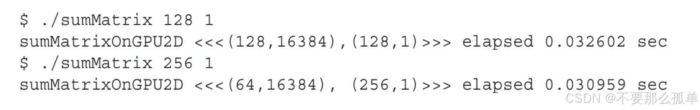

&emsp;&emsp;本节的主要内容就是进一步理解线程束在硬件上执行的本质过程。通过修改核函数的配置，来观察核函数的执行速度，以及分析硬件利用数据，分析性能，调整核函数配置是CUDA开发人员必须掌握的技能。我们将通过二维矩阵求和sumMatrixOn-GPU2D的核函数来进行实验。核函数代码如下：
完整代码：[**https://github.com/dive-into-cuda**](https://github.com/hujianbin03/dive-into-cuda)  
```c
__global__ void sumMatrixOnGPU2D(float *A, float *B, float *C, int NX, int NY)
{
    unsigned int ix = blockIdx.x * blockDim.x + threadIdx.x;
    unsigned int iy = blockIdx.y * blockDim.y + threadIdx.y;
    unsigned int idx = iy * NX + ix;

    if (ix < NX && iy < NY)
    {
        C[idx] = A[idx] + B[idx];
    }
}
```
下面的代码段使线程块的维数可以从命令行中进行配置：
```c
if (argc > 2)
{
	dimx = atoi(argv[1]);
    dimy = atoi(argv[2]);
}

dim3 block(dimx, dimy);
dim3 grid((nx + block.x - 1) / block.x, (ny + block.y - 1) / block.y);
```
## 1.用nvprof检测活跃的线程束
&emsp;&emsp;sumMatrix接收线程块配置的x维作为它的第一个参数，接收线程块配置的y维作为它的第二个参数。通过用适当的命令行参数调用sumMatrix测试各种线程块配置。要先测试一组基础线程块的配置，尤其是大小为（32，32），（32，16），（16，32）和（16，16）的线程块。运行结果如下(书上的图)：

&emsp;&emsp;比较这些结果可以看到，最慢的性能是第一个线程块配置（32，32）。最快的是第二个线程块配置（32，16）。这样可以推断出，第二种情况比第一种情况有更多的线程块，因此它的并行性更好。这个理论可以用nvprof和achieved_occupancy指标来验证。一个内核的可实现占用率被定义为：每周期内活跃线程束的平均数量与一个SM支持的线程束最大数量的比值。结果如下：

从结果中可以观察到两件事：
* 因为第二种情况中的块数比第一种情况的多，所以设备就可以有更多活跃的线程束。其原因可能是第二种情况与第一种情况相比有更高的可实现占用率和更好的性能。
* 第四种情况有最高的可实现占用率，但它不是最快的，因此，更高的占用率并不一定意味着有更高的性能。肯定有其他因素限制GPU的性能。
## 2.用nvprof检测内存操作
&emsp;&emsp;在sumMatrix内核（C[idx]＝A[idx]＋B[idx]）中有3个内存操作：两个内存加载和一个内存存储。可以使用nvprof检测这些内存操作的效率。首先，**用gld_throughput指标检查内核的内存读取效率**，从而得到每个执行配置的差异：

&emsp;&emsp;第四种情况中的加载吞吐量最高，第二种情况中的加载吞吐量大约是第四种情况的一半，但第四种情况却比第二种情况慢。所以，更高的加载吞吐量并不一定意味着更高的性能。后面的章节会介绍内存事务在GPU设备上的工作原理时将会具体分析产生这种现象的原因。

&emsp;&emsp;接下来，**用gld_efficiency指标检测全局加载效率**，即被请求的全局加载吞吐量占所需的全局加载吞吐量的比值。**它衡量了应用程序的加载操作利用设备内存带宽的程度**。结果总结如下：

&emsp;&emsp;从上述结果可知，最后两种情况下的加载效率是最前面两种情况的一半。这可以解释为什么最后两种情况下更高的加载吞吐量和可实现占用率没有产生较好的性能。注意，最后两种情况的共同特征是它们在最内层维数中块的大小是线程束的一半。如前所述，对网格和块启发式算法来说，**最内层的维数应该总是线程束大小的倍数**。后面将讨论半个线程束大小的线程块是如何影响性能的。
## 3.增大并行性
现在继续通过测试sumMatrix使用更大范围的线程配置来发现更多的可能：

可以得出如下结论：
1. 最后一次的执行配置块的大小为（256，8），这是无效的。一个块中线程总数超过了1024个（这是GPU的硬件限制）。
2. 最好的结果是第四种情况，块大小为（128，2）。
3. 第一种情况中块大小为（64，2），尽管在这种情况下启动的线程块最多，但不是最快的配置。
4. 因为第二种情况中块的配置为（64，4），与最好的情况有相同数量的线程块，这两种情况应该在设备上显示出相同的并行性。因为这种情况相比（128，2）仍然表现较差，所以你可以得出这样的结论：**线程块最内层维度的大小对性能起着的关键的作用**。
5. ·在所有其他情况下，线程块的数量都比最好的情况少。因此，增大并行性仍然是性
能优化的一个重要因素。

再来验证一下占用率：


结论如下：
1. 第一种情况（64，2）在所有例子中可实现占用率最低，但它的线程块是最多的。这种情况在线程块的最大数量上遇到了硬件限制。
2. 第四种情况（128，2）和第七种情况（256，2），拥有最高的性能配置，有几乎相同的可实现占用率。在这两种情况下，通过将block.y设置为1来增大块间并行性，观察性能将如何变化。这使得每个线程块大小减少了，引起了更多的线程块被启动来处理相同数量的数据。这样做会产生以下结果：

&emsp;&emsp;到目前为止，这些配置能产生最佳的性能。特别是（256，1）的块配置优于（128，1）。可以使用以下的指令查看可实现占用率、加载吞吐量和加载效率：

&emsp;&emsp;值得注意的是，最好的执行配置既不具有最高的可实现占用率，也不具有最高的加载吞吐量。从这些实验中可以推断出，**没有一个单独的指标能直接优化性能。我们需要在几个相关的指标间寻找一个恰当的平衡来达到最佳的总体性能**。
### 3.1指标与性能
* 在大部分情况下，一个单独的指标不能产生最佳的性能
* 与总体性能最直接相关的指标或事件取决于内核代码的本质
* 在相关的指标与事件之间寻求一个好的平衡
* 从不同角度查看内核以寻找相关指标间的平衡
* 网格/块启发式算法为性能调节提供了一个很好的起点